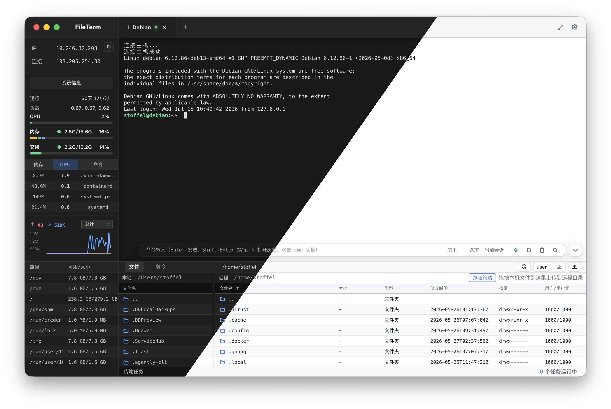

<a id="readme-top"></a>

<div align="center">
  <br />
  
  <br />
  <br />
  <p><strong>一个为开发者和运维场景打造的现代桌面远程工作台，正式版现已发布。</strong></p>
  <p>SSH 终端、SFTP 与 FTP/FTPS 文件、多标签工作区和传输任务中心，收束到一个顺手的桌面客户端里。</p>
  <p>
    <kbd>中文</kbd>
    <kbd><a href="./README_EN.md">English</a></kbd>
  </p>
  <p>
    <a href="./LICENSE"></a>
    <a href="https://github.com/St0ff3l/fileterm/releases/latest"></a>
    
    <a href="https://github.com/St0ff3l/fileterm/stargazers"></a>
  </p>
</div>

---

## 下载正式版

前往 [GitHub Releases](https://github.com/St0ff3l/fileterm/releases/latest) 下载最新正式版：

- **macOS**：提供 Apple Silicon（arm64）和 Intel（x64）安装包。
- **Windows**：提供 x64 NSIS 安装包；已安装的正式版会在应用内下载、验签并在重启后更新。

macOS 的“检查更新”会打开对应的 GitHub Release 下载页，由用户自行下载和安装；Windows 正式安装版使用签名的应用内更新。

需要从源码运行或参与开发？请继续阅读 [从源码开始](#从源码开始)。

## FileTerm 是什么

FileTerm 面向开发者和运维人员的日常远程工作：将远程终端、文件管理、传输任务和连接配置集中到同一个桌面工作区。

- 使用 SSH 时，终端与 SFTP 文件面板自然联动。
- 使用 FTP/FTPS 时，界面直接进入专注文件操作的工作流。
- 多个连接以标签页并行运行，互不打断。
- 上传、下载、进度与错误统一进入传输任务中心。
- 连接配置、工作区状态和主题体验均为长期使用设计。

<p align="center"></p>

正式版聚焦最常用的 `SSH / SFTP / FTP / FTPS` 工作流：把远程终端、文件操作和传输任务做稳、做顺、做漂亮。

## 核心能力

| 能力              | 说明                                                                              |
| ----------------- | --------------------------------------------------------------------------------- |
| SSH 连接管理      | 新增、编辑、删除 SSH 配置；支持文件夹分组和 JSON 持久化。                         |
| FTP/FTPS 连接管理 | 使用独立于 SSH 的连接模型，支持安全 FTP 传输。                                    |
| SSH 终端          | 基于 xterm.js，支持输入输出、自适应尺寸、搜索、剪贴板互通和悬浮命令输入条。       |
| SFTP 文件管理     | 支持远程目录浏览、读写、新建、删除、重命名和权限修改。                            |
| FTP/FTPS 文件管理 | 提供 FTP/FTPS 会话、远程目录浏览、文件操作与可恢复传输。                          |
| 文件编辑器        | 基于 Monaco Editor 的双栏文件树与编辑区，支持语法高亮、查找替换、编码和语言切换。 |
| 终端目录同步      | SSH 终端当前工作目录可与文件管理器双向同步。                                      |
| Root 权限同步     | 感知终端中的 `sudo` / `su`，让文件管理器同步对应权限上下文。                      |
| 虚拟文件列表      | 通过虚拟滚动高效展示大型远程目录。                                                |
| 传输任务中心      | 统一管理上传、下载、断点续传、进度、速度、取消及文件夹递归传输。                  |
| 工作区标签        | 支持多标签并行连接、断开、重连、状态持久化和标签切换动效。                        |
| 命令模板          | 支持快捷命令、文件夹分组、参数占位符和一键发送。                                  |
| 主题与桌面壳      | 支持深色/浅色主题、侧栏、文件抽屉、焦点模式和独立管理窗口。                       |

## 技术栈

| Desktop  | Renderer     | Language          | Terminal | Editor        | Protocols                             | Tooling                |
| -------- | ------------ | ----------------- | -------- | ------------- | ------------------------------------- | ---------------------- |
| Tauri v2 | React + Vite | Rust + TypeScript | xterm.js | Monaco Editor | russh/russh-sftp + suppaftp + tokio-* | Cargo + npm workspaces |

```txt
renderer UI    -> React workspace, tabs, files, terminal
Tauri bridge   -> typed Rust command/event boundary
Rust services  -> session lifecycle, storage, update and protocol services
protocols      -> russh SSH/SFTP, FTP/FTPS, Telnet and Serial adapters
theme system   -> tokens -> vars -> skins -> terminal colors
```

## 架构原则

```txt
Renderer UI
  -> Application State
    -> Tauri API bridge
      -> Rust commands/events
        -> Desktop services
          -> Session workers
            -> Protocol clients
```

- `packages/core` 是领域模型的 single source of truth。
- Renderer 不直接访问 SSH、SFTP、FTP/FTPS protocol clients。
- 所有系统能力必须通过 `Rust commands/events -> tauri-api.ts -> renderer` 暴露。
- SSH/SFTP 与 FTP/FTPS 在 controller/protocol 层保持分离。
- 传输进度统一进入 transfer system，不在组件中分散维护。

完整架构说明见 [docs/architecture.md](./docs/architecture.md)。

## 从源码开始

### 环境要求

- Node.js >= 22.12.0
- npm
- Rust stable 与当前平台所需的 Tauri 系统依赖

### 安装与启动

```bash
npm install
npm run dev # 默认启动 Tauri/Rust 运行时
```

### 常用命令

```bash
npm run dev          # Tauri/Rust
npm run test         # Tauri/Rust 测试
npm run typecheck
npm run build        # Tauri/Rust 生产二进制
npm run release:mac
npm run release:win
```

### 发布与更新

- 推送位于 `release/*` 分支提交上的 `vX.Y.Z` tag，会运行 Tauri 专用 Release Action，发布 macOS arm64/x64 DMG 与 Windows x64 NSIS 安装包。
- Windows Action 同时生成带签名的 NSIS 安装器、`.sig` 签名文件和 `latest.json`；已安装 Windows 客户端从该清单验签后更新。
- 仓库需要配置 GitHub Actions Secret `TAURI_SIGNING_PRIVATE_KEY`。它是 Tauri updater 私钥内容，只能保存为 GitHub Secret，绝不能提交到仓库。
- macOS 发行包使用 ad hoc 签名（不使用 Apple Developer 证书或公证），不使用应用内 updater：检查到新版本后跳转 GitHub Release，由用户选择下载包；首次下载运行仍可能需要在“隐私与安全性”中手动放行。

## 仓库结构

```txt
fileterm/
  apps/
    tauri/                   # Tauri + Rust desktop app
      src/
        bridge/              # typed Tauri command/event API
        renderer/            # React workspace UI
      src-tauri/             # Rust commands, services, sessions and bundling
  packages/
    core/                    # domain types
    storage/                 # repository abstractions
    shared/                  # shared constants and utilities
  docs/
    architecture.md          # architecture map
    roadmap.md               # product roadmap
    plans/                   # active and completed execution plans
    decisions/               # architecture decisions
    quality/                 # quality and release checks
  AGENTS.md                  # map for human and AI collaborators
```

## 路线图

正式版后的演进重点：

1. 持续提升 `SSH / SFTP / FTP / FTPS` 主链路的稳定性与可用性。
2. 继续拆分 Tauri workspace、session service 和 renderer 的职责，进一步明确分层边界。
3. 将领域类型继续收敛到 `packages/core`。
4. 持续完善传输任务、错误提示、主题、终端输入、文件抽屉和桌面壳体验。
5. 维护 macOS 与 Windows 正式版的分发和发布质量。

完整计划见 [docs/roadmap.md](./docs/roadmap.md)。

## 开源组件

- [xterm.js](https://xtermjs.org/)：用于 SSH 终端渲染、输入输出和窗口尺寸适配。
- [Monaco Editor](https://microsoft.github.io/monaco-editor/)：用于文件编辑、语法高亮和查找替换。

## 参与贡献

仓库把代码库本身作为记录系统：

- [AGENTS.md](./AGENTS.md) 是协作入口地图。
- [docs/architecture.md](./docs/architecture.md) 记录稳定的架构事实。
- [docs/plans/active](./docs/plans/active) 存放跨层进行中的计划。
- [docs/decisions](./docs/decisions) 记录已确认的架构选择。
- [.agents/extensions](./.agents/extensions) 存放功能草案与扩展设计。

如果计划贡献较大的功能，建议先补充一份 active plan，再开始编码。

## 贡献者

感谢每一位让 FileTerm 变得更好的贡献者。

<table>
  <tr>
    <td align="center" width="180">
      <a href="https://github.com/St0ff3l">
        
        <br />
        <sub><b>St0ff3l</b></sub>
      </a>
    </td>
    <td>构建了 Rust/Tauri 后端核心，打通 command/event、会话控制、文件能力与工作区状态等核心链路。</td>
  </tr>
  <tr>
    <td align="center" width="180">
      <a href="https://github.com/Flashhhhhhzj">
        
        <br />
        <sub><b>Flashhhhhhzj</b></sub>
      </a>
    </td>
    <td>重构并设计前端样式，统一设计语言，推动主题 token、组件皮肤和整体视觉体验成形。</td>
  </tr>
</table>

## 社区交流

扫码加入 **FileTerm** 微信交流群，与开发者和其他用户交流使用体验、问题反馈与后续版本动态。

也可加入 QQ 群：`534418986`。


## 支持项目

如果 FileTerm 对你有帮助，欢迎到 [GitHub](https://github.com/St0ff3l/fileterm) 点亮 Star：

<a href="https://github.com/St0ff3l/fileterm/stargazers"></a>

## 开源协议

FileTerm 使用 [MIT License](./LICENSE) 开源。

<p align="right"><a href="#readme-top">回到顶部</a></p>
