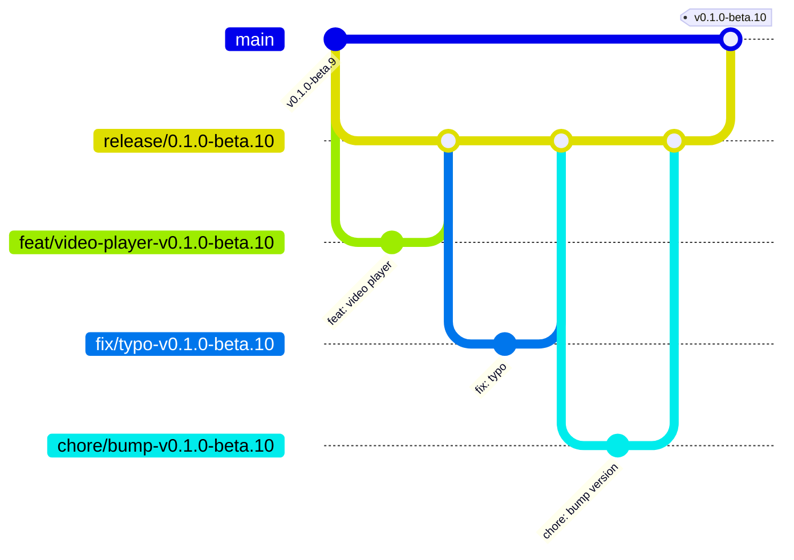

# 🚀 发版工作流

## 核心原则



- **每个版本一条 release 分支**，如 `release/0.1.0-beta.10`
- **release 分支受保护**，禁止直接 push，所有改动（包括版本号 bump）必须通过分支 + PR 进入
- **日常开发往 release 分支合**，main 只在发版时收一次最终 PR
- **main 上的 tag 是唯一发版触发器**，不往 main 乱打 tag

---

## 第一步：日常开发

### 1.1 从 release 分支拉功能分支

```bash
# 分支命名：<type>/<name>-v<version>
# type: feat | fix | chore | refactor | docs

git checkout -b feat/add-video-player-v0.1.0-beta.10 release/0.1.0-beta.10
```

### 1.2 分支命名规范

```
feat/<功能描述>-v0.1.0-beta.10
fix/<修复描述>-v0.1.0-beta.10
chore/<杂项>-v0.1.0-beta.10
```

带上版本号的好处：一眼就知道这个分支属于哪个迭代，切错版本的概率大幅降低。

### 1.3 开发 → Commit → Push

```bash
git add .
git commit -m "feat: 添加视频播放器组件"
git push -u origin feat/add-video-player-v0.1.0-beta.10
```

---

## 第二步：提 PR

在 GitHub 创建 Pull Request 时：

| 字段 | 填写 |
|---|---|
| **Base** | `release/0.1.0-beta.10`（⚠️ 不是 main） |
| **Compare** | `feat/add-video-player-v0.1.0-beta.10` |

> 这一步最关键：日常 PR 全部往 release 分支合，main 平时不碰。

---

## 第三步：发版前 Bump 版本号

当 release 分支上所有功能都合完、自测通过后。**release 分支受保护**，不能直接 push，所以 bump 版本号也要走分支 + PR 流程：

```bash
# 1. 从 release 切出版本号 bump 分支
git checkout -b chore/bump-v0.1.0-beta.10 release/0.1.0-beta.10

# 2. 只修改根 package.json 的 version 字段
#    - package.json: "version": "0.1.0-beta.10"
#
#    然后执行同步命令，或直接运行 build/typecheck/release，让 pre-script 自动同步：
npm run sync:version

#    这会同步更新：
#    - apps/desktop/package.json
#    - packages/core/package.json
#    - packages/storage/package.json
#    - package-lock.json

git add package.json apps/desktop/package.json packages/core/package.json packages/storage/package.json package-lock.json
git commit -m "chore: bump version to 0.1.0-beta.10"
git push -u origin chore/bump-v0.1.0-beta.10
```

```bash
# 3. 在 GitHub 提 PR：
#    Base:    release/0.1.0-beta.10
#    Compare: chore/bump-v0.1.0-beta.10
#    合并后 release 分支上的版本号即更新完毕
```

---

## 第四步：终极大 PR（release → main）

测试全部通过、准备上线时，由负责人提一个合并 PR：

```bash
# GitHub 上创建 PR：
# Base:   main
# Compare: release/0.1.0-beta.10
```

合并后立刻：

```bash
git checkout main
git pull origin main
git tag v0.1.0-beta.10
git push origin v0.1.0-beta.10
```

**tag push 后 GitHub Actions 自动触发打包**（macOS arm64/x64 + Windows x64），完成后自动创建 Pre-release。

---

## 第五步：准备下一个版本

```bash
git checkout -b release/0.1.0-beta.11 main
git push origin release/0.1.0-beta.11
```

新一轮开发从新的 release 分支开始。

---

## 一图总结

```
feat/A-v0.1.0 ──┐
                ├──> release/0.1.0 ──> (测试通过) ──> main ──> tag v0.1.0
feat/B-v0.1.0 ──┘                                        │
                                                    release/0.2.0
                                                         │
feat/C-v0.2.0 ──┐                                       │
                ├──> release/0.2.0 ──────────────────────┘
feat/D-v0.2.0 ──┘
```

---

## Release 分支 vs CI

CI（`ci.yml`）应当监听两类分支：

```yaml
# 每次 push 跑 lint/test
on:
  push:
    branches:
      - 'feat/**'
      - 'fix/**'
      - 'release/**'
  pull_request:
    branches:
      - 'release/**'
```

Release workflow（`release.yml`）只在 **main 上打 tag** 时触发打包：

```yaml
on:
  push:
    tags:
      - 'v*-beta*'
```

---

## 快速检查清单

- [ ] 功能分支从 `release/x.y.z` 创建
- [ ] 分支名带版本号：`feat/<name>-v0.1.0`
- [ ] PR 的 Base 选 release 分支（不是 main）
- [ ] 代码 Review 通过后合并到 release 分支
- [ ] 所有功能合完后，从 release 切 `chore/bump-v0.1.0` 分支改版本号，提 PR 合回 release
- [ ] release → main 的发版 PR 由负责人合并
- [ ] 合并后立即在 main 上打 tag
- [ ] tag push 触发构建 Action
