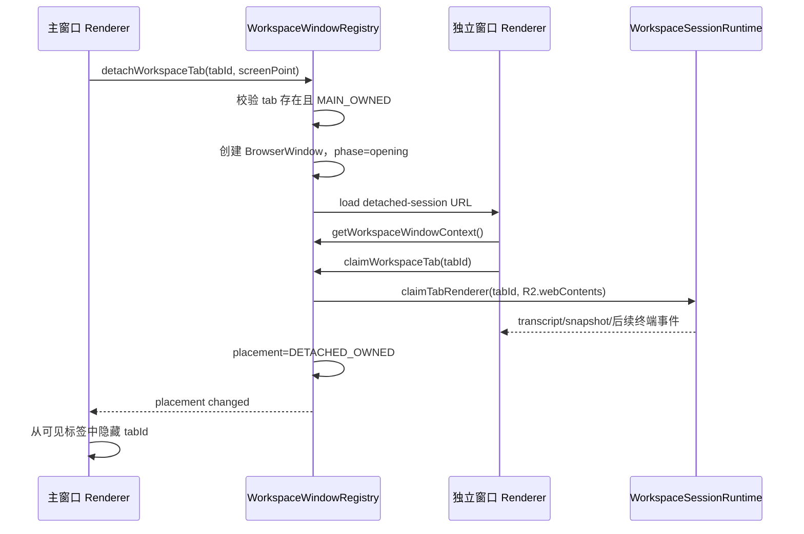

# 可拆分会话窗口实施规格

> 状态：设计已确认，等待实施计划评审  
> 日期：2026-07-14  
> 交互模式：移动模式——会话从主窗口移入独立窗口，关闭独立窗口后返回主窗口，连接不中断。

## 1. 背景

FileTerm 已支持多个 SSH、FTP、Telnet、Serial 会话标签，也已经具备多 `BrowserWindow`、统一 preload、workspace snapshot 广播和 main-process 会话运行时。

目标是允许用户把一个会话标签拖出主窗口，形成独立桌面窗口，并在整个迁移过程中保持：

- SSH、SFTP、FTP、Telnet、Serial controller 不重建。
- 终端连接、远程路径、sudo/root 状态、隧道和传输任务不中断。
- 同一个会话任一时刻只由一个 workspace renderer 展示和控制。
- 关闭独立窗口时，会话返回主窗口，而不是关闭连接。

核心原则：

```txt
会话生命周期属于 WorkspaceSessionRuntime
窗口生命周期属于 main process window registry
renderer 只展示 main 分配给当前窗口的会话

拖窗迁移的是展示所有权，不是 protocol controller
```

## 2. 当前基线与关键缺口

### 已有基础

- `main.ts` 已管理主窗口、连接管理器、命令管理器和文件编辑器窗口。
- `loadAppWindow()` 已支持通过 query 参数选择 renderer 窗口模式。
- `workspace:snapshot` 已能广播到多个 `BrowserWindow`。
- `WorkspaceSessionRuntime` 在 main process 持有 live controller 与 `SessionSnapshot`。
- `SessionWorkspace`、`TerminalView`、文件管理和系统侧栏可以复用。
- 标签栏已经支持 HTML drag-and-drop 排序。

### 必须修正的缺口

#### 2.1 workspace sender 绑定过宽

当前 `WorkspaceTabLifecycleService.bindWorkspaceSender(sender)` 会把所有 tab 绑定到调用 `workspace:getSnapshot` 的 sender。独立会话窗口如果复用这条入口，会抢走所有会话的终端输出。

必须把“读取 snapshot”和“认领 tab 展示权”拆开：

```txt
getSnapshot()              只读取全局领域快照
claimTabRenderer(tabId)    显式认领单个 tab
releaseTabRenderer(tabId)  有条件释放单个 tab
```

#### 2.2 tab sender 释放存在竞态风险

当前 runtime 使用：

```ts
Map<tabId, WebContents>
```

拆窗期间 sender 会从主窗口切换到独立窗口。旧 renderer 随后销毁时，不能无条件删除新 sender。

释放接口必须携带并核对 sender：

```ts
releaseTabRenderer(tabId, sender)
```

仅当当前 owner 仍等于该 sender 时才能释放。

#### 2.3 `activeTabId` 是全局状态

`WorkspaceSnapshot.activeTabId` 当前由 `WorkspaceTabsState` 全局维护。多窗口下，每个窗口都有自己的当前内容，全局 active tab 不能继续作为所有窗口的 UI 选择来源。

第一阶段不删除该字段，以保持现有服务兼容，但规定：

- 主窗口的活动标签继续由 renderer 本地 UI 状态决定，并在需要时同步现有 `activateTab()`。
- 独立会话窗口固定展示窗口上下文中的 `tabId`，忽略全局 `activeTabId`。
- 独立窗口的终端聚焦、resize 和文件面板状态不得修改主窗口的活动标签。
- 后续如果更多窗口类型需要多标签，再单独评估从领域快照移除全局 `activeTabId`。

## 3. 目标与非目标

### 目标

1. 会话标签可从主窗口拖出为独立窗口。
2. 一个独立窗口第一版只承载一个远程会话。
3. 拖出过程中连接与 controller 保持存活。
4. 独立窗口关闭或执行“返回主窗口”时，会话重新出现在主窗口。
5. 主窗口不重复显示已拆出的会话。
6. 同一个 tab 任一时刻只有一个有效 renderer owner。
7. Windows、macOS、Linux 使用各自正确的窗口和标题栏语义。
8. 多显示器与 DPI 缩放环境下，新窗口出现在合理位置。

### 非目标

- 不支持镜像同一会话。
- 不支持一个独立窗口承载多个标签。
- 不支持两个独立窗口之间合并标签。
- 不支持跨 FileTerm 进程拖放。
- 第一版不持久化独立窗口布局，不在应用重启后自动恢复。
- 不引入 Zustand 或新的全局 renderer store。
- 不迁移或重建 protocol controller。

## 4. 领域与 IPC 模型

新增类型优先放入 `packages/core`。

```ts
export type WorkspaceWindowKind = 'main' | 'detached-session'

export interface WorkspaceWindowContext {
  windowId: string
  kind: WorkspaceWindowKind
  tabId?: string
}

export interface WorkspaceTabPlacement {
  tabId: string
  ownerWindowId: string
  ownerKind: WorkspaceWindowKind
}

export interface DetachWorkspaceTabInput {
  tabId: string
  screenPoint?: {
    x: number
    y: number
  }
}
```

`WorkspaceWindowContext` 是 renderer 的只读启动上下文。`WorkspaceTabPlacement` 由 main process 管理，不进入 profile 持久化，也不属于 protocol session snapshot。

### Preload API

```ts
getWorkspaceWindowContext(): Promise<WorkspaceWindowContext>
detachWorkspaceTab(input: DetachWorkspaceTabInput): Promise<void>
attachWorkspaceTab(tabId: string): Promise<void>
claimWorkspaceTab(tabId: string): Promise<void>
```

必要事件：

```ts
onWorkspaceTabPlacementChanged(
  listener: (placements: WorkspaceTabPlacement[]) => void
): () => void
```

Renderer 不能直接访问 `BrowserWindow`、`WebContents` 或 Electron `screen`。

## 5. Main process 模块职责

### 5.1 `WorkspaceWindowRegistry`

新增独立服务，避免继续把所有窗口状态堆入 `main.ts`。

建议位置：

```txt
apps/desktop/src/main/services/windows/workspace-window-registry.ts
```

职责：

- 注册主 workspace 窗口。
- 创建和销毁 detached session 窗口。
- 维护 `windowId -> BrowserWindow`。
- 维护 `tabId -> ownerWindowId`。
- 防止同一 tab 重复创建独立窗口。
- 负责 detach/attach 两阶段状态迁移。
- 在窗口销毁时恢复 placement。
- 向 workspace renderer 广播 placement 变化。

它不负责：

- SSH/SFTP/FTP/Telnet/Serial controller 生命周期。
- 工作区 tab 的创建、连接、断开或关闭。
- xterm 渲染细节。
- React 本地布局状态。

### 5.2 窗口集合

第一版使用：

```ts
Map<string, BrowserWindow> // windowId -> window
Map<string, DetachedWindowRecord> // tabId -> detached record
Map<number, string> // webContents.id -> windowId
```

其中：

```ts
interface DetachedWindowRecord {
  windowId: string
  tabId: string
  window: BrowserWindow
  phase: 'opening' | 'ready' | 'closing'
}
```

### 5.3 窗口创建语义

Detached session window 是顶层工作窗口，不是普通 child window：

- 不设置 `parent`。
- `modal: false`。
- 可最小化、最大化、移动到其他显示器。
- Windows 使用 FileTerm 自定义标题栏。
- macOS 使用 `hiddenInset` 与原生 traffic lights。
- Linux 优先使用原生 frame。
- 使用当前安全设置：`contextIsolation: true`、`nodeIntegration: false`、`sandbox: true`、共享受控 partition。

启动 URL：

```txt
?window=detached-session&windowId=<windowId>&tabId=<tabId>
```

query 仅用于 renderer 启动提示。最终上下文必须通过 main registry 的 `getWorkspaceWindowContext()` 获取和校验。

## 6. 展示所有权状态机

### 6.1 状态

```txt
MAIN_OWNED
DETACH_OPENING
DETACHED_OWNED
ATTACHING
CLOSING_SESSION
```

`CLOSING_SESSION` 表示用户真正关闭连接，不是关闭独立窗口。

### 6.2 拖出流程



约束：

- 新窗口 ready 并成功 claim 前，主窗口仍保留标签。
- 新窗口加载失败、超时或 claim 失败时，销毁新窗口并保持 `MAIN_OWNED`。
- detach 请求幂等；重复请求聚焦已有独立窗口。

### 6.3 返回主窗口

触发入口：

- 点击独立窗口的“返回主窗口”。
- 独立窗口关闭按钮。
- 独立窗口中的 `Ctrl/Cmd+W`。
- 独立 renderer 崩溃或窗口意外销毁。

流程：

```txt
placement -> ATTACHING
主窗口重新 claim tab renderer
placement -> MAIN_OWNED
主窗口恢复标签并选择合理 fallback/active tab
销毁独立窗口
```

正常关闭时优先等待主窗口 claim 成功后再销毁独立窗口。异常崩溃时先把 placement 恢复为 `MAIN_OWNED`，主窗口在下一次可用时认领。

### 6.4 真正关闭连接

“关闭独立窗口”和“关闭会话”必须是两个不同动作。

真正关闭连接沿用现有 `workspace.closeTab(tabId)`：

```txt
用户选择“关闭连接”
  -> 原有连接确认
  -> workspace.closeTab(tabId)
  -> runtime teardown
  -> 清除 placement
  -> 关闭 detached BrowserWindow
```

## 7. WorkspaceSessionRuntime 调整

### 7.1 明确 owner API

建议把含义不清晰的 `setSender()` 收敛为：

```ts
claimTabRenderer(tabId: string, sender: WebContents): void
releaseTabRenderer(tabId: string, sender: WebContents): void
getTabRenderer(tabId: string): WebContents | undefined
```

`releaseTabRenderer()` 必须 compare-and-release：

```ts
if (currentSender === sender) {
  tabSenders.delete(tabId)
}
```

### 7.2 snapshot 与终端事件分离

- 全局 `workspace:snapshot` 可以继续广播给 workspace 窗口。
- `terminal:data`、SSH 交互、需要 tab 焦点的事件只发送给 tab owner。
- 系统指标可以由全局 snapshot/metrics 事件传播，但 detached renderer 只消费自身 `tabId`。
- 普通管理器和文件编辑器窗口不应被识别为 workspace owner。

### 7.3 迁移间隙输出

迁移期间不能依赖 renderer 持有唯一终端历史。现有 controller/runtime transcript 继续作为恢复来源。

第一版策略：

1. detach 前 flush `TerminalOutputBatcher`。
2. 新 renderer claim 后先从 snapshot 中恢复 `terminalTranscript`。
3. owner 切换后，新的 `terminal:data` 只发往新 sender。
4. 新 `TerminalView` mount 后立即发送真实 cols/rows resize。

如果验证发现 flush 与 snapshot 之间仍可能丢极短输出，再为每个 tab 增加有限序列号或迁移缓冲；第一版不预先引入复杂事件日志。

## 8. Renderer 架构

### 8.1 窗口路由

不要继续在 `App.tsx` 内堆叠大量分支。建议新增：

```txt
features/windowing/
  WorkspaceWindowRouter.tsx
  MainWorkspaceWindow.tsx
  DetachedSessionWindow.tsx
  useWorkspaceWindowContext.ts
```

路由：

```txt
WorkspaceWindowRouter
  ├─ main                 -> MainWorkspaceWindow
  └─ detached-session     -> DetachedSessionWindow
```

现有其他 standalone 管理窗口仍保持当前路径，本计划不强行重构无关窗口。

### 8.2 主窗口过滤

主窗口保留完整 workspace snapshot，但构造可见 session tabs 时排除：

```ts
placements.filter((item) => item.ownerKind === 'detached-session')
```

过滤只影响展示，不得调用 `closeTab()`，也不得从 `WorkspaceSnapshot.tabs` 删除领域 tab。

### 8.3 独立窗口内容

Detached window 固定使用上下文 `tabId` 查找：

- `WorkspaceTab`
- `SessionSnapshot`
- `ConnectionProfile`
- 与该 tab 关联的 transfer tasks

复用现有：

- `SessionWorkspace`
- `TerminalView`
- `FileManager`
- `SystemSidebarShell`
- `TransferCenterHost`

独立窗口不展示：

- 首页标签。
- 连接管理器标签。
- 其他 session 标签。
- “新建标签”按钮。

### 8.4 标签拖拽判定

当前标签拖拽只处理标签间排序。新增 detach 判断时不应把逻辑直接塞入 `TabBar`。

建议职责：

```txt
TabBar
  -> 只报告 drag start / drag end / pointer screen position

useWorkspaceTabDetach
  -> 判断是否离开有效 tab strip/window 区域
  -> 调用 preload detach API
  -> 处理失败反馈
```

第一版可采用明确、稳定的触发规则：

- 仅 session tab 可拆出；首页和系统信息本地 tab 不可拆出。
- drag end 时，指针在当前窗口外或离开标签栏超过阈值才 detach。
- 仍在标签栏区域时只做排序。
- 触摸板与鼠标都必须避免轻微抖动触发拆窗。

如果 HTML5 drag 在 Electron 上无法稳定提供跨窗口外坐标，允许改用 pointer-driven drag overlay，但不能依赖浏览器原生跨进程 DnD 自动完成窗口创建。

## 9. 关闭、退出与托盘语义

### 独立窗口关闭

- 关闭按钮：返回主窗口。
- `Ctrl/Cmd+W`：返回主窗口。
- 不弹“断开 SSH”确认。
- 不执行 workspace shutdown。

### 主窗口关闭

沿用现有退出/隐藏决策链，但 detached session windows 不应被简单当作普通 child window：

- 如果用户选择隐藏应用，主窗口和 detached windows 应一起隐藏，并在恢复应用时恢复各自可见状态。
- 如果产品决定 detached windows 在主窗口隐藏时仍保持可见，需要另行确认；第一版默认应用级一致隐藏。
- 如果用户确认真正退出，统一等待 transfer journal 与 workspace shutdown，再关闭所有 detached windows。

### macOS

- `Cmd+W` 关闭当前独立窗口并收回 tab。
- `Cmd+Q` 进入统一退出确认链。
- `window-all-closed` 不应因为 detached window 关闭而结束 workspace。

## 10. 多显示器与平台边界

Main process 根据 renderer 传入的 `screenPoint` 使用 Electron `screen`：

```txt
screen.getDisplayNearestPoint(point)
  -> 计算工作区 workArea
  -> 修正初始窗口 bounds
  -> 保证标题栏位于可见区域
```

要求：

- Windows 125%/150% DPI 下不出现明显坐标偏移。
- 从副屏拖出时窗口落在副屏。
- 显示器移除后窗口 bounds 能回到现有显示器。
- macOS traffic lights 不与自定义内容重叠。
- Windows 自定义拖拽区与窗口按钮保持 `drag/no-drag` 边界。
- Linux 不强制复刻 Windows 自绘标题栏。

## 11. 错误处理与恢复

| 场景                           | 处理                                                        |
| ------------------------------ | ----------------------------------------------------------- |
| tab 不存在或正在关闭           | 拒绝 detach，保留主窗口状态                                 |
| 同一 tab 重复 detach           | 聚焦已有独立窗口                                            |
| 新窗口加载失败                 | 销毁窗口，placement 回滚 `MAIN_OWNED`                       |
| 新 renderer claim 超时         | 回滚并提示用户                                              |
| detached renderer 崩溃         | placement 恢复主窗口，连接继续                              |
| 主窗口 renderer 崩溃           | detached owner 不受影响；主窗口恢复后只认领 main-owned tabs |
| owner 旧 sender 延迟销毁       | compare-and-release，不能删除新 owner                       |
| 应用真正退出                   | 禁止自动 attach，直接统一 shutdown                          |
| tab 在 detached 状态被真正关闭 | 清除 placement 并关闭对应窗口                               |

## 12. 分阶段实施

### Phase 1：模型与窗口注册表

- [ ] 在 `packages/core` 增加窗口上下文、placement 和 detach input 类型。
- [ ] 新增 `WorkspaceWindowRegistry`。
- [ ] 将主窗口注册为稳定 `windowId`。
- [ ] 增加 detached session `BrowserWindow` 创建与平台参数。
- [ ] 将 detached windows 纳入统一退出与隐藏链路。

验收：可通过临时 IPC 创建一个绑定 tabId 的独立窗口，关闭后不退出应用。

### Phase 2：owner 与 runtime 安全迁移

- [ ] 将 `setSender()` 重构为 claim/release/get owner API。
- [ ] 去除 `bindWorkspaceSender()` 对所有 tabs 的无条件覆盖。
- [ ] `workspace:getSnapshot` 不再隐式认领全部 tab。
- [ ] 主窗口显式认领 main-owned tabs。
- [ ] detached 窗口只认领自己的 tab。
- [ ] 增加旧 sender 销毁竞态测试。

验收：两个 renderer 同时存在时，不会互相抢走无关 tab 的终端输出。

### Phase 3：Renderer 独立会话窗口

- [ ] 增加 `WorkspaceWindowRouter` 与 `DetachedSessionWindow`。
- [ ] 复用 `SessionWorkspace` 渲染单个 tab。
- [ ] 主窗口按 placement 隐藏 detached tab。
- [ ] 独立窗口忽略全局 `activeTabId`。
- [ ] 实现关闭窗口后 attach 回主窗口。
- [ ] 实现 detached 窗口标题栏和平台样式。

验收：手动触发 detach 后，终端、文件区和系统信息持续可用；关闭窗口后标签回归。

### Phase 4：拖拽交互

- [ ] 新增 `useWorkspaceTabDetach`。
- [ ] 区分标签排序和离窗拆分。
- [ ] 只允许 session tab 拆出。
- [ ] 新窗口按鼠标所在显示器定位。
- [ ] detach 失败时恢复标签并展示错误。
- [ ] 增加右键菜单“在独立窗口打开”，作为拖拽失败时的可访问入口。

验收：鼠标和触摸板操作稳定，不因普通排序误触发拆窗。

### Phase 5：回归、文档与清理

- [ ] 更新 `docs/architecture.md` 的窗口 ownership 边界。
- [ ] 根据最终实现补充架构决策记录。
- [ ] 检查主窗口关闭、托盘隐藏、`Cmd/Ctrl+Q`、`Cmd/Ctrl+W`。
- [ ] 检查 transfer、SSH interaction、系统指标和文件编辑窗口不受影响。
- [ ] 完成 Windows 实机验证；macOS/Linux 至少完成构建与人工检查清单。

## 13. 自动化测试

### Main/runtime 单元测试

- 主窗口只能认领 `MAIN_OWNED` tabs。
- detached window 只能认领上下文指定 tab。
- 重复 detach 聚焦原窗口，不创建第二个窗口。
- 旧 sender release 不会删除新 sender。
- detached renderer 销毁后 placement 回到 main。
- 真正关闭 tab 会清除 detached window record。
- 应用退出时不会执行 attach 回主窗口。

### Renderer 测试

- 主窗口过滤 detached placements。
- detached window 固定选择 context tabId。
- 全局 `activeTabId` 变化不切换 detached 内容。
- 首页和 system local tab 不触发 detach。
- detach 失败后标签仍可见。
- 关闭独立窗口调用 attach，而不是 closeTab。

### 回归测试

- SSH terminal input/output/resize。
- SFTP 路径、CWD 跟随、sudo/root 同步。
- FTP 文件操作。
- Telnet/Serial terminal-only layout。
- transfer task 的 tabId 隔离。
- SSH MFA/host fingerprint 弹窗发送到正确 owner。
- reconnect、disconnect、close tab。

## 14. 手工验收矩阵

### 基础链路

1. 打开两个 SSH 标签。
2. 把第二个标签拖出到独立窗口。
3. 两个终端分别持续输出，互不串流。
4. 在独立窗口执行命令、resize、切换文件目录。
5. 主窗口切换其他标签不影响独立窗口。
6. 关闭独立窗口，标签回到主窗口且连接未断开。

### 异常链路

1. detached 窗口加载期间快速关闭。
2. detached renderer 强制 reload/crash。
3. 连接正在 connecting 时拖出。
4. 正在传输文件时拖出和收回。
5. SSH MFA/host key 确认期间拖出。
6. detached 状态下真正关闭连接。

### 平台链路

- Windows：自定义标题栏、任务栏、多屏和 DPI。
- macOS：traffic lights、`Cmd+W`、`Cmd+Q`、Dock/托盘恢复。
- Linux：原生 frame、窗口关闭和多屏定位。

## 15. 完成标准

只有同时满足以下条件才视为完成：

- 拖出和收回不重建 controller，不断开活动连接。
- 同一 tab 不会同时出现在主窗口和独立窗口。
- 同一 tab 任一时刻只有一个有效终端事件 owner。
- sender 销毁竞态有自动测试覆盖。
- 主窗口和 detached window 的关闭/退出语义不混淆。
- Windows 实机拖拽、多屏、最大化和关闭通过。
- typecheck、lint、format、test、build 全部通过。
- `docs/architecture.md` 与最终实现一致。
