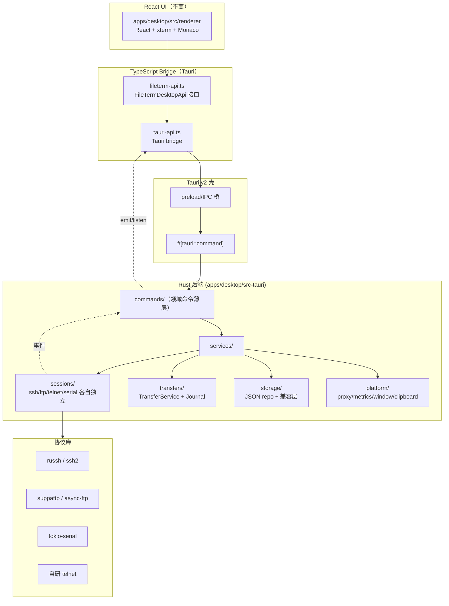
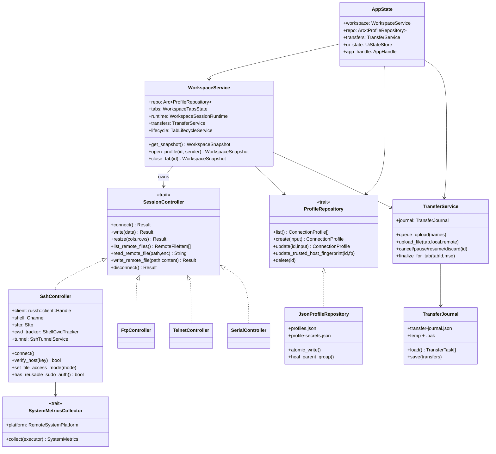
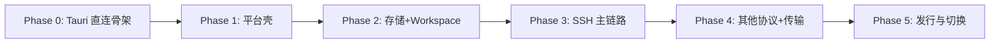
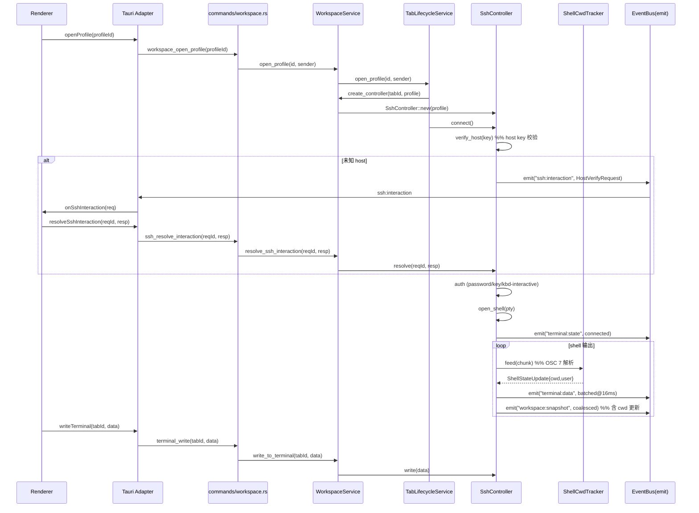
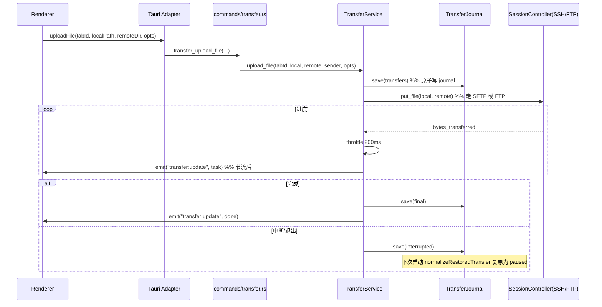
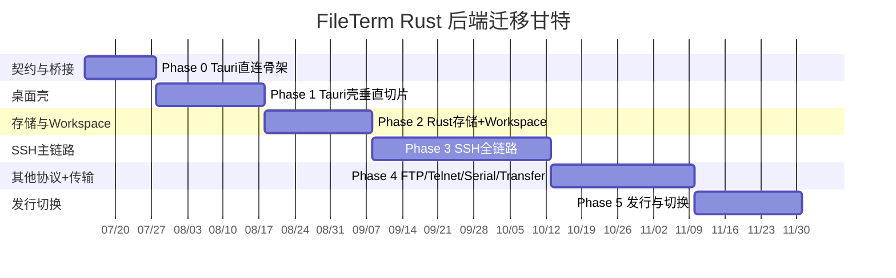

# FileTerm Rust 后端迁移计划

| 项目       | 值                                                        |
| ---------- | --------------------------------------------------------- |
| 文档版本   | v1.2                                                      |
| 更新日期   | 2026-07-15                                                |
| 状态       | Phase 0–4 代码主体已完成；Phase 5 发布与外部验收进行中    |
| 编写人     | 高见远（架构师）                                          |
| 适用分支   | `tauri-rust-migration-roadmap`                            |
| 仓库根目录 | `/Users/stoffel/CodeFile/fileterm`                        |
| 关联文档   | `docs/plans/active/tauri-rust-migration.md`（高层路线图） |

---

## 当前执行状态

实际 Rust/Tauri 工程位于 `apps/desktop/src-tauri`（不是早期草案中的 `apps/desktop-tauri`）。截至 2026-07-15：

- Phase 0–2 已完成：Tauri bridge、桌面壳、Rust JSON 存储、Workspace snapshot、旧 Electron 数据兼容和 contract test 已落地。
- Phase 3 已完成 SSH 垂直切片：russh shell/SFTP、MFA/host verification、系统指标、CWD/远端用户跟随、Jump Host、重连、编码、递归 chmod、SOCKS5/HTTP CONNECT 代理和运行时 SSH `-L/-R/-D` 隧道。
- Phase 3 代码主体已完成；尚缺真实 SSH/代理服务、三平台 socket 生命周期和发行候选手测。
- Phase 4（FTP/FTPS、Telnet、Serial、Transfer、WebDAV、导入导出和日志等）代码主体已完成；真实服务/设备验收仍在进行。
- Phase 5 已开始：macOS Tauri production DMG 和本机性能基线已完成；签名 updater、公证、Windows/Linux 包、迁移工具与正式切换未完成。

本计划的模块设计和里程碑仍然有效，但实现状态以 `tauri-migration-progress.md` 和实际 `apps/desktop/src-tauri/src/` 代码为准。

---

## 1. 执行摘要

FileTerm 的历史基线是 Electron 42.4.0 + React + TypeScript，支持 SSH/SFTP、FTP/FTPS、Telnet、Serial 四类协议。当前分支已切换到 Tauri v2 + Rust；历史 Electron 主进程约 50 个 TS 文件、总计约 8800 行核心代码仍保留作为对照，承载的协议会话、文件传输、workspace 运行时、系统指标采集和 JSON 存储已由 Rust backend 接管。

本计划描述将后端从 Node.js/Electron 主进程**直接迁移到 Rust（Tauri v2 壳）**，同时**完全保留现有 React UI 不变**。迁移以「Tauri 直连骨架 + 类型化 bridge」为起点，按领域垂直切片推进；Electron 不再作为目标运行时或回滚入口。

核心策略：

1. **契约收敛**：renderer 继续依赖 `FileTermDesktopApi`（定义在 `packages/core`），通过唯一的 Tauri bridge 调用 Rust commands/events。
2. **垂直切片**：按「平台壳 → 存储/Workspace → SSH 主链路 → 其他协议 + 传输」逐层迁移，每层可独立验证。
3. **存储渐进**：第一阶段 Rust 仍用 JSON 文件（临时文件 + 原子 rename），与现有 `profiles.json` / `profile-secrets.json` / `transfer-journal.json` 完全兼容；SQLite 作为「可选增强」在协议稳定后再评估，不在主迁移路径上。
4. **凭据策略不变**：明文 + `chmod 0600` 的有意决策保留，迁移期间不引入钥匙串/safeStorage。
5. **单运行时**：Electron 不再作为生产运行时、adapter 或回滚方案；未迁移能力必须由 Tauri command 明确返回 unsupported。
6. **协议物理分离**：SSH/SFTP 与 FTP/Telnet/Serial 在 Rust 侧各为独立 crate 模块，不伪统一。

预期收益：内存与启动时间显著下降、协议 I/O 走原生异步运行时、消除 V8 主进程开销、为未来移动/服务端形态留出空间。

---

## 2. 当前后端架构分析

> 本节基于实际代码（`apps/desktop/src/main/`），不臆测。

### 2.1 历史 Electron 技术栈（迁移前对照）

| 维度       | 现状                                                                           |
| ---------- | ------------------------------------------------------------------------------ |
| 历史桌面壳 | Electron 42.4.0（迁移前 lockfile；当前 manifest 已移除 Electron 依赖）         |
| 当前桌面壳 | Tauri v2（Cargo.lock `tauri 2.11.5`；npm 脚本为 `tauri dev/build`）            |
| 前端       | React + TypeScript + Vite + xterm.js + Monaco Editor                           |
| SSH/SFTP   | `ssh2`（Node 原生绑定，依赖 `cpu-features`，见 `vendor/cpu-features-shim`）    |
| FTP/FTPS   | `basic-ftp`                                                                    |
| Serial     | `serialport`（原生绑定）                                                       |
| Telnet     | 自研（基于 `node:net`，RFC 854）                                               |
| 代理       | 自研 `proxy-socket-factory.ts`（SOCKS5 + HTTP CONNECT，基于 `node:net`）       |
| 编码       | `iconv-lite`、`opencc-js`                                                      |
| 存储       | JSON 文件（明文，`profiles.json` + `profile-secrets.json`，后者 `chmod 0600`） |
| 历史打包   | electron-builder（仅用于 Electron 对照/历史发布资料）                          |
| 当前打包   | Tauri bundler                                                                  |

### 2.2 主进程代码结构（约 50 个 TS 文件）

```
apps/desktop/src/main/
├── main.ts                          # Electron 主入口（1112 行）
├── ipc/                             # IPC handler 按领域拆分（8 个模块）
│   ├── index.ts                     # registerIpcHandlers：装配 WorkspaceService 等
│   ├── types.ts
│   ├── app-handlers.ts              # 窗口/剪贴板/UI preferences/应用更新/退出
│   ├── local-files-handlers.ts      # 本地文件浏览
│   ├── remote-files-handlers.ts     # 远程文件 list/stat/mkdir/rename/delete/upload/download
│   ├── ssh-interaction-handlers.ts  # SSH 交互请求（MFA/密码输入）
│   ├── terminal-handlers.ts         # 终端 write/resize/data/state 事件
│   ├── transfer-handlers.ts         # 传输任务管理
│   └── workspace-handlers.ts        # workspace snapshot/连接库/导入导出/SSH 隧道
├── services/
│   ├── workspace-service.ts         # façade（489 行），薄委托到 runtime/transfer/tabLifecycle
│   ├── file-profile-repository.ts   # profile CRUD + group/parentId 自愈（914 行）
│   ├── local-files-service.ts
│   ├── app-logger.ts / app-ui-state-store.ts / app-update-service.ts
│   ├── connection-config-codec.ts / text-encoding.ts / webdav-sync-service.ts
│   ├── session-controllers.ts       # 旧聚合（已拆分）
│   ├── network/proxy-socket-factory.ts   # SOCKS5/HTTP CONNECT
│   ├── sessions/
│   │   ├── base-file-session-controller.ts
│   │   ├── ssh-session-controller.ts     # 3401 行，SSH/SFTP 主控制器
│   │   ├── ftp-session-controller.ts / serial-session-controller.ts / telnet-session-controller.ts
│   │   ├── session-file-utils.ts / shell-cwd-integration.ts（OSC 7 cwd 跟随）
│   │   ├── ssh-debug-logger.ts / ssh-tunnel-service.ts（-L/-R/-D，295 行）
│   │   └── system-metrics/              # 多平台指标采集（9 文件）
│   ├── transfers/                        # 独立传输模块
│   │   ├── transfer-service.ts（1404 行）/ transfer-journal.ts / transfer-manifest.ts
│   │   └── transfer-file-utils.ts / transfer-runtime-utils.ts
│   └── workspace/
│       ├── workspace-session-runtime.ts（1208 行，全局事件分发 + 快照广播）
│       ├── workspace-tabs.ts / workspace-tab-lifecycle.ts / workspace-transfers.ts
│       ├── terminal-output-batcher.ts（16ms 终端输出合并）
│       └── seed-data.ts
```

### 2.3 关键架构特征（迁移必须保留的约束）

| #   | 约束                     | 当前实现位置                                                                    | 迁移要求                                       |
| --- | ------------------------ | ------------------------------------------------------------------------------- | ---------------------------------------------- |
| C1  | Renderer 零协议直连      | renderer 只通过 `window.fileterm`                                               | Rust 侧 renderer 仍不直连协议库                |
| C2  | IPC 端到端类型安全       | preload.cts 映射 `ipcRenderer.invoke`                                           | Tauri command 走 serde 双向类型化              |
| C3  | SSH/SFTP 与 FTP 物理分离 | `ssh-session-controller` vs `ftp-session-controller`                            | Rust 模块各自独立，不伪统一                    |
| C4  | CWD 跟随（OSC 7）        | `shell-cwd-integration.ts` 解析 `\u001b]7;` + `1337;RemoteUser=`                | Rust 侧保留 OSC 解析器 + runtime 广播          |
| C5  | POSIX 注入门控           | `platform-probe.ts`：仅 linux/busybox 返回 true，Windows 严禁注入               | Rust `SystemMetricsCollector` 保留门控         |
| C6  | CRLF 归一化              | `system-metrics/parser.ts`：`replace(/\r\n?/g, '\n')`                           | Rust 解析前统一归一化                          |
| C7  | 传输统一 + journal       | `transfers/transfer-service.ts` + `transfer-journal.json`（原子 rename + .bak） | Rust `TransferService` 保留 journal 与断点续传 |
| C8  | 高频事件边界             | 终端 16ms batcher、传输 200ms 节流、snapshot 单飞尾随合并                       | Rust 侧对应节流/合并策略                       |
| C9  | 凭据明文存储             | `profile-secrets.json` + `chmod 0600`，有意决策                                 | 迁移期间保留，不引入钥匙串                     |
| C10 | 离线资源就地化           | 图标/字体打包进产物                                                             | Tauri 资源打包同样离线                         |

### 2.4 前后端契约：FileTermDesktopApi

renderer 通过 `window.fileterm`（类型 `FileTermDesktopApi`，定义于 `packages/core/src/index.ts:738`，约 160 个方法/字段）访问后端。`preload.cts` 把每个方法映射到 `ipcRenderer.invoke('xxx:yyy')`（命令）或 `ipcRenderer.on('xxx:yyy')`（事件）。

契约可分为 7 个领域（详见第 5 节）：

1. **平台/应用信息**：`platform`/`arch`/`appVersion`/`appName`/`isDesktop`
2. **应用更新**：`getUpdateStatus`/`checkForUpdates`/`downloadUpdate`/`installUpdate`/`onUpdateStatus`
3. **剪贴板/UI**：`readClipboardText`/`writeClipboardText`/`getUiPreferences`/`setUiPreferences`/`getUiStateItem`/`setUiStateItem`/`removeUiStateItem`/`onUiPreferencesChanged`
4. **窗口/子窗口**：`openConnectionManagerWindow`/`openCommandManagerWindow`/`openConnectionFormWindow`/`openCommandFormWindow`/`openFileEditorWindow`/`openExternalUrl`/`openLogsDirectory`/窗口控制/`showWindowMenu`/`onWindowMaximizedChange`/`onFileEditorCloseRequest`/`onWindowCloseRequest`/`confirmCloseWindow`/`requestQuitApp`
5. **Workspace/连接库**：`getSnapshot`/`getConnectionLibrary`/导入导出/SSH 隧道/WebDAV 同步/profile/folder/command CRUD/排序
6. **会话/终端/远程文件**：`openProfile`/`reconnectTab`/`activateTab`/`disconnectTab`/`closeTab`/`writeTerminal`/`resizeTerminal`/远程文件 CRUD/`setRemoteFileAccessMode`/`setFollowShellCwd`/`resolveSshInteraction`
7. **传输**：`queueUpload`/`cancelTransfer`/`pauseTransfer`/`resumeTransfer`/`discardTransfer`/`clearTransfers`/`uploadFile`/`downloadFile`/`downloadRemotePath`

高频事件：`terminal:data`、`terminal:state`、`transfer:update`、`workspace:snapshot`、`workspace:sessionMetrics`、`ssh:interaction`、`app:window-close-request`、`app:close-active-workspace-item-request`。

### 2.5 当前架构痛点（迁移动机）

| 痛点                                        | 现状                            | 迁移收益                                              |
| ------------------------------------------- | ------------------------------- | ----------------------------------------------------- |
| `ssh2` 原生绑定跨平台脆弱                   | 依赖 `cpu-features`，需 shim    | Rust `russh` 纯 Rust，或 `ssh2` crate（libssh2 绑定） |
| Electron 主进程内存占用高                   | V8 + Node 运行时常驻            | Rust 原生进程，内存大幅降低                           |
| 终端输出经 Node 事件循环                    | 16ms batcher 缓解，仍有 V8 开销 | Rust tokio + channel 直发                             |
| `ssh-session-controller.ts` 3401 行巨型文件 | 难维护                          | 按职责拆分为多个 Rust 模块                            |
| JSON 全量读写                               | profile 增多后读写放大          | 后续可平滑引入 SQLite（见第 4 节）                    |

---

## 3. Rust 后端目标架构与模块划分

### 3.1 目标架构总览



### 3.2 Rust 模块划分

新增 `apps/desktop/src-tauri/src/`，按领域分层。模块边界与 TS 侧一一对应，便于迁移与对照。

```
apps/desktop/src-tauri/src/
├── main.rs                       # Tauri 入口，装配 AppState
├── lib.rs
├── error.rs                      # 统一错误类型 FileTermError + serde 序列化
├── state.rs                      # AppState：持有 Workspace、TransferService、Repo 等
├── commands/                     # #[tauri::command] 薄层（对应 ipc/*-handlers.ts）
│   ├── mod.rs
│   ├── app.rs                    # 对应 app-handlers.ts
│   ├── local_files.rs            # 对应 local-files-handlers.ts
│   ├── remote_files.rs           # 对应 remote-files-handlers.ts
│   ├── ssh_interaction.rs        # 对应 ssh-interaction-handlers.ts
│   ├── terminal.rs               # 对应 terminal-handlers.ts
│   ├── transfer.rs               # 对应 transfer-handlers.ts
│   └── workspace.rs              # 对应 workspace-handlers.ts
├── services/
│   ├── workspace.rs              # 对应 workspace-service.ts（façade）
│   ├── workspace/
│   │   ├── session_runtime.rs    # 对应 workspace-session-runtime.ts（事件分发 + 快照）
│   │   ├── tabs.rs               # 对应 workspace-tabs.ts
│   │   ├── tab_lifecycle.rs      # 对应 workspace-tab-lifecycle.ts
│   │   ├── terminal_batcher.rs   # 对应 terminal-output-batcher.ts（16ms）
│   │   └── seed.rs               # 对应 seed-data.ts
│   ├── transfers/
│   │   ├── service.rs            # 对应 transfer-service.ts
│   │   ├── journal.rs            # 对应 transfer-journal.ts（原子 rename + .bak）
│   │   ├── manifest.rs           # 对应 transfer-manifest.ts
│   │   └── utils.rs
│   ├── sessions/
│   │   ├── mod.rs                # SessionController trait + 共享类型
│   │   ├── base.rs               # 对应 base-file-session-controller.ts
│   │   ├── ssh.rs                # 对应 ssh-session-controller.ts（拆分！）
│   │   ├── ssh/
│   │   │   ├── connect.rs        # 连接/jumphost/proxy
│   │   │   ├── host_verify.rs   # host key 验证
│   │   │   ├── auth.rs           # password/key/keyboard-interactive/system(ssh-agent)
│   │   │   ├── shell.rs          # PTY shell + write/resize
│   │   │   ├── sftp.rs           # SFTP 文件操作
│   │   │   ├── exec.rs           # exec channel + 系统指标采集执行器
│   │   │   ├── sudo.rs           # root 文件访问模式
│   │   │   ├── tunnel.rs         # 对应 ssh-tunnel-service.ts（-L/-R/-D）
│   │   │   └── debug_logger.rs
│   │   ├── ftp.rs                # 对应 ftp-session-controller.ts
│   │   ├── telnet.rs             # 对应 telnet-session-controller.ts
│   │   ├── serial.rs            # 对应 serial-session-controller.ts
│   │   ├── shell_cwd.rs          # 对应 shell-cwd-integration.ts（OSC 7）
│   │   ├── session_file_utils.rs
│   │   └── system_metrics/
│   │       ├── mod.rs           # 对应 system-metrics/index.ts
│   │       ├── types.rs          # 对应 types.rs（SystemMetricsExecutor/Collector）
│   │       ├── parser.rs         # CRLF 归一化
│   │       ├── platform_probe.rs # 平台探测 + POSIX 注入门控
│   │       ├── posix_script.rs
│   │       ├── linux.rs / busybox.rs / windows.rs
│   │       └── windows_metrics.rs
│   ├── storage/
│   │   ├── mod.rs               # ProfileRepository trait（对应 packages/storage）
│   │   ├── json_repo.rs         # 对应 FileProfileRepository（JSON + 原子写）
│   │   ├── secrets.rs           # 对应 profile-secrets.json + chmod 0600
│   │   ├── ui_state.rs          # 对应 app-ui-state-store.ts
│   │   └── migration.rs         # 旧用户数据兼容/迁移
│   └── platform/
│       ├── proxy.rs             # 对应 proxy-socket-factory.ts（SOCKS5/HTTP CONNECT）
│       ├── clipboard.rs / window.rs / app_update.rs / webdav.rs
│       └── encoding.rs          # iconv-lite / opencc-js 等价
└── models/                       # serde 类型，对应 @fileterm/core
    ├── mod.rs
    ├── profile.rs / transfer.rs / workspace.rs / metrics.rs / ssh_interaction.rs
    └── ...
```

### 3.3 关键 Rust trait 与数据结构



### 3.4 SessionController 抽象（关键设计）

TS 侧 `FileSessionController` 是隐式接口（结构性类型）。Rust 侧显式定义 trait，保留「协议物理分离」的同时统一生命周期与文件操作入口：

```rust
// services/sessions/mod.rs
#[async_trait::async_trait]
pub trait SessionController: Send {
    fn controller_type(&self) -> SessionType;
    async fn connect(&mut self) -> Result<(), FileTermError>;
    async fn disconnect(&mut self) -> Result<(), FileTermError>;
    // 终端协议（ssh/telnet/serial）实现；ftp 返回 NotImplemented
    async fn write(&mut self, data: &str) -> Result<(), FileTermError>;
    async fn resize(&mut self, cols: u16, rows: u16) -> Result<(), FileTermError>;
    // 文件协议（ssh-sftp/ftp）实现；telnet/serial 返回 NotImplemented
    async fn list_remote_files(&self) -> Result<Vec<RemoteFileItem>, FileTermError>;
    async fn read_remote_file(&self, path: &str, enc: Option<&str>) -> Result<String, FileTermError>;
    async fn write_remote_file(&mut self, path: &str, content: &str, enc: Option<&str>) -> Result<(), FileTermError>;
    async fn rename_remote_path(&mut self, path: &str, next: &str) -> Result<(), FileTermError>;
    async fn delete_remote_path(&mut self, path: &str, kind: &str) -> Result<(), FileTermError>;
    async fn change_remote_permissions(&mut self, path: &str, opts: &PermissionChangeOptions) -> Result<(), FileTermError>;
    async fn ensure_remote_directory(&mut self, path: &str) -> Result<(), FileTermError>;
}
```

> 设计要点：trait 仅聚合「共同能力」，不强行让 FTP 与 SSH 共享 SFTP 实现细节。SSH 的 `set_file_access_mode`/`has_reusable_sudo_auth`/`verify_host` 等专属能力放在 `SshController` 自身，不进 trait。

### 3.5 事件发射模型

Tauri 用 `AppHandle::emit(event, payload)` 替代 Electron 的 `webContents.send`。Rust 侧封装一个 `EventBus`，对应 TS 的 7 类高频事件，并保留节流边界：

```rust
// services/workspace/session_runtime.rs
pub struct WorkspaceSessionRuntime {
    app: AppHandle,
    terminal_batcher: TerminalOutputBatcher, // 16ms 合并
    snapshot_coalesce: SnapshotCoalescer,    // 单飞尾随合并
    // ...
}
impl WorkspaceSessionRuntime {
    // 终端数据：16ms batcher -> emit("terminal:data", payload)
    pub fn emit_terminal_data(&self, tab_id: &str, chunk: String) { ... }
    // 传输进度：200ms 节流 -> emit("transfer:update", task)
    pub fn emit_transfer_update(&self, task: TransferTask) { ... }
    // snapshot：单飞 + 尾随合并 -> emit("workspace:snapshot", snap)
    pub fn emit_snapshot(&self, snap: WorkspaceSnapshot) { ... }
}
```

---

## 4. 存储迁移方案（JSON → 是否引入 SQLite / ORM 选型论证）

### 4.1 现状：JSON 文件存储

当前 `FileProfileRepository`（`file-profile-repository.ts`，914 行）管理 7 个 JSON 文件：

| 文件                                     | 内容                                             | 写入方式                                              | 当前处理 |
| ---------------------------------------- | ------------------------------------------------ | ----------------------------------------------------- | -------- |
| `profiles.json`                          | 连接 profile（明文，secret 已剥离）              | `writeFile` 直接覆盖                                  | 全量读写 |
| `profile-secrets.json`                   | password/privateKeyPath/passphrase/proxyPassword | `writeFile` + `chmod 0600`                            | 全量读写 |
| `folders.json`                           | 连接文件夹树                                     | `writeFile`                                           | 全量读写 |
| `command-folders.json` / `commands.json` | 命令模板                                         | `writeFile`                                           | 全量读写 |
| `command-history.json`                   | 终端命令历史（按 profileId）                     | `writeFile`                                           | 全量读写 |
| `command-send-preferences.json`          | 命令发送偏好                                     | `writeFile`                                           | 全量读写 |
| `transfer-journal.json`                  | 传输任务（最近 200 条）                          | **临时文件 + rename + .bak**（`transfer-journal.ts`） | 原子写   |

关键特性：

- **profile-secrets 分离存储**：`splitProfileSecrets` 把敏感字段剥离到独立文件并 `chmod 0600`，snapshot 不含 secret（C9）。
- **group/parentId 自愈**：`readProfiles` 每次读取时根据 `folders.json` 自愈 `group` 与 `parentId` 的不一致。
- **旧 demo 数据清理**：`removeLegacyDemoData` 在 ensure 时清理历史 demo id。
- **inline secret 迁移**：`migrateProfileSecrets` 把旧版内联 secret 迁到 `profile-secrets.json`。
- **transfer-journal 已是原子写**：`temp -> rename current to .bak -> rename temp to current`，失败回滚。

### 4.2 论证：是否在迁移中引入 SQLite

| 维度                 | 继续 JSON（推荐第一阶段）            | 引入 SQLite                           |
| -------------------- | ------------------------------------ | ------------------------------------- |
| 与现有用户数据兼容   | ✅ 零迁移，直接读旧文件              | ❌ 需一次性导入脚本 + 双向兼容期      |
| 迁移复杂度           | 低（Rust 逐字复刻读写逻辑）          | 高（schema 设计 + ORM + 迁移 + 测试） |
| 并发写               | 需串行化（当前是全量写，单进程足够） | 原生支持                              |
| profile 规模（当前） | 几十~几百条，全量读写无性能问题      | 杀鸡用牛刀                            |
| 命令历史增长         | 可能增长，但已按 profile 分桶        | 适合（可索引/分页）                   |
| 风险                 | 低                                   | 与协议迁移耦合，回归面扩大            |
| 用户期望             | 与现有行为完全一致                   | 需解释「为什么数据格式变了」          |

**结论与决策：**

> **第一阶段（Phase 2 存储迁移）继续使用 JSON 文件，不引入 SQLite。** 理由：
>
> 1. 当前 profile/命令规模远未到 JSON 性能瓶颈；
> 2. JSON 与现有 Electron 用户数据零迁移成本，是「契约不变」原则在存储层的延伸；
> 3. 把存储格式变更与后端语言迁移**解耦**，降低单次迁移风险；
> 4. `transfer-journal` 已是原子写，Rust 侧直接复刻即可。

> **SQLite 作为「可选增强」单独立项（Phase 6+，迁移完成后）：** 仅在「命令历史分页查询」「profile 突破千级」「需要全文检索」等真实需求出现时再引入。届时路径为：JSON → SQLite 一次性导入 + 双读兼容期 → 切换。这样把「语言迁移」和「存储格式迁移」彻底分开，符合最小风险原则。

### 4.3 Rust 存储实现

#### 4.3.1 ORM/序列化选型

| 选项                           | 用途           | 选型     | 理由                                       |
| ------------------------------ | -------------- | -------- | ------------------------------------------ |
| `serde` + `serde_json`         | JSON 序列化    | ✅ 必选  | 事实标准，与 `@fileterm/core` 类型一一对应 |
| `rusqlite` / `sqlx`            | SQLite（未来） | ⏸ 不引入 | 见 4.2 决策                                |
| `tokio::fs`                    | 异步文件 IO    | ✅ 必选  | 与 tokio 运行时统一                        |
| `tempfile` + `std::fs::rename` | 原子写         | ✅ 必选  | 复刻 transfer-journal 的 temp+rename+.bak  |

#### 4.3.2 ProfileRepository trait（对应 `packages/storage`）

```rust
// services/storage/mod.rs
#[async_trait::async_trait]
pub trait ProfileRepository: Send + Sync {
    async fn list(&self) -> Result<Vec<ConnectionProfile>, FileTermError>;
    async fn list_folders(&self) -> Result<Vec<ConnectionFolder>, FileTermError>;
    async fn create(&self, input: CreateProfileInput) -> Result<ConnectionProfile, FileTermError>;
    async fn update(&self, id: &str, input: CreateProfileInput) -> Result<ConnectionProfile, FileTermError>;
    async fn update_trusted_host_fingerprint(&self, id: &str, fp: &str) -> Result<Option<ConnectionProfile>, FileTermError>;
    async fn get_by_id(&self, id: &str) -> Result<Option<ConnectionProfile>, FileTermError>;
    async fn delete(&self, id: &str) -> Result<(), FileTermError>;
    async fn touch_profile(&self, id: &str) -> Result<(), FileTermError>;
    // folders / command folders / command templates / order / history / send prefs ...
}
```

#### 4.3.3 JsonProfileRepository 关键行为复刻

```rust
// services/storage/json_repo.rs
pub struct JsonProfileRepository {
    base_dir: PathBuf,
    profiles_path: PathBuf,
    secrets_path: PathBuf,
    folders_path: PathBuf,
    // ...对应 7 个文件
}

impl JsonProfileRepository {
    /// 原子写：temp -> rename(.bak) -> rename(temp -> current)
    /// 复刻 transfer-journal.ts 的 writeJournal 模式，应用于所有 JSON 文件
    async fn atomic_write_json<T: Serialize>(&self, path: &Path, value: &T) -> Result<(), FileTermError> {
        let tmp = path.with_extension("tmp");
        let bak = path.with_extension("bak");
        tokio::fs::write(&tmp, serde_json::to_vec_pretty(value)?).await?;
        // best-effort: rename current -> bak
        let _ = tokio::fs::rename(path, &bak).await;
        tokio::fs::rename(&tmp, path).await.map_err(|e| {
            // 回滚：bak -> current
            let _ = std::fs::rename(&bak, path);
            FileTermError::io(e)
        })?;
        let _ = tokio::fs::remove_file(&bak).await;
        Ok(())
    }

    /// profile-secrets.json 写入后 chmod 0600（保留 C9 决策）
    #[cfg(unix)]
    async fn lock_down(&self, path: &Path) -> Result<(), FileTermError> {
        use std::os::unix::fs::PermissionsExt;
        tokio::fs::set_permissions(path, std::fs::Permissions::from_mode(0o600)).await?;
        Ok(())
    }

    /// group/parentId 双向自愈（复刻 readProfiles 的自愈逻辑）
    async fn read_profiles_healed(&self) -> Result<Vec<ConnectionProfile>, FileTermError> {
        let mut profiles = self.read_profiles_raw().await?;
        let folders = self.read_folders().await.unwrap_or_default();
        let mut modified = false;
        for p in profiles.iter_mut() {
            // ...对照 TS readProfiles 的自愈分支
        }
        if modified { self.write_profiles(&profiles).await?; }
        Ok(profiles)
    }
}
```

#### 4.3.4 数据兼容与迁移

| 场景                                | 处理                                                                                                |
| ----------------------------------- | --------------------------------------------------------------------------------------------------- |
| 旧 Electron 用户首次启动 Tauri      | Rust `JsonProfileRepository` 直接读现有 JSON，无需转换                                              |
| `normalizeStoredProfile` 旧格式自愈 | Rust 侧复刻同等归一化逻辑（补 `type`/`authType`/`sftpEnabled`/`remotePath`/`forwards` 等默认值）    |
| inline secret 迁移                  | Rust 启动时检测并执行 `migrate_profile_secrets`                                                     |
| legacy demo 数据清理                | Rust 复刻 `remove_legacy_demo_data`（同样 id 集合）                                                 |
| 写回兼容                            | Rust 写出的 JSON 格式与 TS 一致（`serde_json::to_string_pretty`，2 空格缩进），保证 Electron 仍可读 |

> 验收：同一份用户数据目录，Electron 与 Tauri 互相读写，profile/secret/folder/command/history 行为完全一致。

---

## 5. API 契约保障方案（Tauri bridge / contract test）

### 5.1 契约冻结：FileTermDesktopApi 作为唯一真相源

`FileTermDesktopApi`（`packages/core/src/index.ts:738`）是 renderer 与 Rust 后端的唯一契约。迁移期必须保证：**同一份 React 代码通过 Tauri bridge 调用 Rust commands/events**。

### 5.2 Tauri bridge 架构


新增 bridge 目录（与现有路线图一致）：

```
apps/desktop/src/bridge/
└── tauri-api.ts         # 调用 @tauri-apps/api 的 invoke/listen
```

#### 5.2.1 Tauri bridge

`tauri-api.ts` 把每个 `FileTermDesktopApi` 方法映射到 Tauri：

```ts
// apps/desktop/src/bridge/tauri-api.ts
import { invoke } from '@tauri-apps/api/core'
import { listen, type UnlistenFn } from '@tauri-apps/api/event'
import type { FileTermDesktopApi, WorkspaceSnapshot } from '@fileterm/core'

export const tauriApi: FileTermDesktopApi = {
  platform: await invoke<string>('app_platform'),
  // ... 同步字段在初始化时一次性读取并缓存
  getSnapshot: () => invoke<WorkspaceSnapshot>('workspace_get_snapshot'),
  writeTerminal: (tabId, data) => invoke('terminal_write', { tabId, data }),
  resizeTerminal: (tabId, cols, rows, width, height) => invoke('terminal_resize', { tabId, cols, rows, width, height }),
  onTerminalData: (listener) => {
    let unlisten: UnlistenFn | undefined
    listen('terminal:data', (e) => listener(e.payload)).then((fn) => (unlisten = fn))
    return () => unlisten?.()
  }
  // ... 其余方法按同一模式映射
}
```

#### 5.2.3 命名映射约定

为保证 React 与 Rust 契约稳定，固化命名映射规则：

| TS 方法                 | Electron IPC             | Tauri command/event         |
| ----------------------- | ------------------------ | --------------------------- |
| `getSnapshot`           | `workspace:getSnapshot`  | `workspace_get_snapshot`    |
| `writeTerminal`         | `terminal:write`（send） | `terminal_write`（invoke）  |
| `onTerminalData`        | `terminal:data`（on）    | `terminal:data`（listen）   |
| `resolveSshInteraction` | `ssh:resolveInteraction` | `ssh_resolve_interaction`   |
| `onSshInteraction`      | `ssh:interaction`（on）  | `ssh:interaction`（listen） |

> 规则：Electron 用 `domain:action`，Tauri command 用 `domain_action`（下划线），Tauri event 保留 `domain:action`（与 Electron event 同名，便于 adapter 统一）。**这份映射表本身就是契约的一部分，需冻结并纳入 contract test。**

#### 5.2.4 `writeTerminal` 语义差异处理

Electron 用 `ipcRenderer.send`（fire-and-forget），Tauri 用 `invoke`（有返回值）。adapter 层统一为「不等待返回」语义（`void`），Tauri 侧 command 立即返回 `Ok(())`，实际写入在后台 tokio task。

### 5.3 Contract Test（契约测试）

为保证两个 adapter「形状一致」，建立 contract test 套件：

```
apps/desktop/src/bridge/__tests__/
├── contract.spec.ts        # 对 FileTermDesktopApi 每个方法做形状/错误/返回类型断言
└── fixtures/                # 共享 mock 数据
```

```ts
// contract.spec.ts（示意）
import type { FileTermDesktopApi } from '@fileterm/core'
// 两个 adapter 都注入，断言同一输入产生同一（mock）输出形状
function runContractTests(label: string, api: FileTermDesktopApi) {
  it(`${label}: getSnapshot returns WorkspaceSnapshot`, async () => { ... })
  it(`${label}: writeTerminal is void`, async () => { ... })
  it(`${label}: onTerminalData returns unsubscribe`, () => { ... })
  // 覆盖全部 ~160 个方法/字段
}
```

> 验收：两个 adapter 通过同一套 contract test，且现有 Electron 行为不回归。

### 5.4 类型双源同步

迁移初期：Rust `models/` 用 `serde` 手写与 `@fileterm/core` 对应的类型。**不在初期引入代码生成**，避免与协议迁移耦合。协议稳定后（Phase 3+）再评估 `ts-rs` 或 JSON Schema 生成。

---

## 6. API 接口逐步迁移顺序（按领域排序，含依赖关系）

### 6.1 迁移顺序总原则

按「依赖最少 → 依赖最多」「无状态 → 有状态」「低频 → 高频」推进。每个领域完成即解锁下游领域。



### 6.2 领域迁移顺序明细

| 顺序 | 领域                           | TS 来源                                               | Rust 目标                                                  | 依赖           | 备注                        |
| ---- | ------------------------------ | ----------------------------------------------------- | ---------------------------------------------------------- | -------------- | --------------------------- |
| 1    | 平台信息                       | `preload` 字段                                        | `commands/app.rs`                                          | 无             | 最简单，先打通 invoke 链路  |
| 2    | 剪贴板                         | `app-handlers.ts`                                     | `platform/clipboard.rs`                                    | 1              | 验证 Tauri clipboard plugin |
| 3    | UI preferences/state           | `app-ui-state-store.ts`                               | `storage/ui_state.rs`                                      | 1              | JSON 存储，验证原子写       |
| 4    | 本地文件                       | `local-files-service.ts` + handlers                   | `commands/local_files.rs` + `services/local_files`         | 1              | 验证文件选择器/权限         |
| 5    | 存储（profile/folder/command） | `file-profile-repository.ts`                          | `storage/json_repo.rs`                                     | 3              | 复刻自愈/secret 分离        |
| 6    | Workspace snapshot/连接库      | `workspace-service.ts` 部分 + `workspace-handlers.ts` | `services/workspace.rs` + `commands/workspace.rs`          | 5              | 广播事件验证                |
| 7    | 导入导出/WebDAV                | `workspace-handlers.ts`                               | `platform/webdav.rs` + `commands/workspace.rs`             | 6              |                             |
| 8    | 窗口/子窗口/退出               | `app-handlers.ts` + `main.ts`                         | `platform/window.rs`                                       | 1              | 跨平台窗口行为              |
| 9    | 应用更新                       | `app-update-service.ts`                               | `platform/app_update.rs`                                   | 1              | Tauri updater               |
| 10   | SSH 连接+认证+host verify      | `ssh-session-controller.ts` connect/verify/auth       | `sessions/ssh/{connect,host_verify,auth}.rs`               | 6              | SSH PoC 锁定 crate          |
| 11   | SSH shell+终端                 | ssh write/resize + `terminal-handlers.ts`             | `sessions/ssh/shell.rs` + `commands/terminal.rs` + batcher | 10             | 16ms batcher 验证           |
| 12   | SFTP 文件操作                  | `remote-files-handlers.ts` + ssh sftp 方法            | `sessions/ssh/sftp.rs` + `commands/remote_files.rs`        | 11             |                             |
| 13   | CWD 跟随 + sudo                | `shell-cwd-integration.ts` + ssh sudo                 | `sessions/shell_cwd.rs` + `sessions/ssh/sudo.rs`           | 12             | OSC 7 解析                  |
| 14   | 系统指标                       | `system-metrics/*`                                    | `sessions/system_metrics/*`                                | 11             | 平台探测/CRLF/门控          |
| 15   | SSH 交互请求（MFA）            | `ssh-interaction-handlers.ts`                         | `commands/ssh_interaction.rs`                              | 10             | keyboard-interactive        |
| 16   | SSH 隧道                       | `ssh-tunnel-service.ts`                               | `sessions/ssh/tunnel.rs`                                   | 10             | -L/-R/-D                    |
| 17   | 传输系统                       | `transfers/*`                                         | `services/transfers/*`                                     | 12             | journal+断点续传            |
| 18   | FTP/FTPS                       | `ftp-session-controller.ts`                           | `sessions/ftp.rs`                                          | 5,12(共享传输) | 独立 crate                  |
| 19   | Telnet                         | `telnet-session-controller.ts`                        | `sessions/telnet.rs`                                       | 5              | 自研                        |
| 20   | Serial                         | `serial-session-controller.ts`                        | `sessions/serial.rs`                                       | 5              | tokio-serial                |
| 21   | 发行/打包/切换                 | `main.ts` + electron-builder                          | Tauri bundler + updater                                    | 全部           | Phase 5                     |

### 6.3 关键时序：SSH 连接 + 终端 + CWD 跟随



### 6.4 关键时序：传输（上传）+ journal 持久化



---

## 7. 认证与权限系统迁移策略

> 本节的「认证」指 **SSH/SFTP/FTP/Telnet 协议凭据的存储与使用**，以及 host verification / MFA / proxy 链路，不是应用登录鉴权。

### 7.1 凭据存储迁移（保留明文决策）

当前凭据存储（`file-profile-repository.ts`）：

- 公开部分在 `profiles.json`（password/privateKeyPath/passphrase/proxyPassword 已剥离）。
- 敏感部分在 `profile-secrets.json`，结构 `{version:1, profiles:{[id]:{field:{storage:'plain-text-fallback', value}}}}`，写入后 `chmod 0600`。
- `splitProfileSecrets` / `mergeProfileSecrets` 在读写时分离/合并。

**迁移策略：Rust 侧完全复刻，保留 C9 决策（明文 + 0600）。**

```rust
// services/storage/secrets.rs
#[derive(Serialize, Deserialize)]
pub struct StoredProfileSecret {
    pub storage: String,   // "plain-text-fallback"
    pub value: String,
}
#[derive(Serialize, Deserialize)]
pub struct StoredProfileSecrets {
    pub version: u32,       // 1
    pub profiles: HashMap<String, HashMap<ProfileSecretField, StoredProfileSecret>>,
}
```

- `lock_down` 在 unix 上 `chmod 0600`，Windows 上 best-effort（与 TS 行为一致）。
- **不引入** `russh::keys::SecretKey` 持久化、不引入系统钥匙串、不引入 `keyring` crate（除非未来产品定位变化，单独立项）。
- 凭据在内存中的生命周期：仅在 `SshController::connect` / `FtpController::connect` 时从 repo 读取并传入协议库，连接建立后不再保留明文副本（与 TS 一致）。

### 7.2 SSH 认证链路迁移

TS 侧 `ssh-session-controller.ts` 支持 `SshAuthType`：`'password' | 'privateKey' | 'system' | 'keyboard-interactive'`。

| 认证方式                    | TS 实现（ssh2）                                                                                           | Rust 实现                                                                  | crate 选型           |
| --------------------------- | --------------------------------------------------------------------------------------------------------- | -------------------------------------------------------------------------- | -------------------- |
| password                    | `client.authenticatePassword`                                                                             | `russh::client::Handle::authenticate_password`                             | russh                |
| privateKey                  | 读文件 + passphrase -> `authenticatePublicKey`                                                            | `russh::keys::load_secret_key` + `authenticate_publickey`                  | russh + `russh-keys` |
| keyboard-interactive（MFA） | `keyboard-interactive` handler -> 触发 `ssh:interaction` 事件 -> renderer 收集 -> `resolveSshInteraction` | `KeyboardInteractiveAuth` 回调 -> emit `ssh:interaction` -> 等待 `resolve` | russh（支持）        |
| system（ssh-agent）         | `agentForward` / 默认 agent                                                                               | russh 默认走系统 agent（`SSH_AUTH_SOCK`）                                  | russh                |

**russh vs ssh2 crate 选型论证：**

| 维度                 | `russh`（纯 Rust）      | `ssh2`（libssh2 绑定）                  |
| -------------------- | ----------------------- | --------------------------------------- |
| 跨平台构建           | ✅ 纯 Rust，无 C 依赖   | ❌ 需 libssh2，Windows/macOS 需额外配置 |
| 维护活跃度           | ✅ 活跃                 | ⚠️ 绑定维护一般                         |
| SFTP 支持            | ✅ `russh-sftp`         | ✅ 内置                                 |
| keyboard-interactive | ✅ 原生异步回调         | ⚠️ 同步回调                             |
| 性能                 | 异步原生，与 tokio 契合 | 同步，需 spawn_blocking                 |
| 风险                 | API 变更较频繁          | 稳定但陈旧                              |

> **决策：首选 `russh` + `russh-sftp`**。理由：纯 Rust 消除原生绑定脆弱性（正是迁移动机之一）、异步原生契合 tokio、keyboard-interactive 支持更自然。**每个平台先做 PoC（macOS/Windows/Linux）再锁定**，若某平台 PoC 失败则回退 `ssh2` crate（libssh2 绑定），架构上 SessionController trait 抽象使切换成本可控。

### 7.3 Host Verification 迁移

TS 侧 `verifyHostFingerprint`（`ssh-session-controller.ts:776`）：连接时拿到 host key，若与 `profile.trustedHostFingerprint` 不符，触发 `SshInteractionRequest`（host-verification），renderer 弹窗确认，确认后 `rememberTrustedHostFingerprint` 持久化。

Rust 侧迁移：

```rust
// sessions/ssh/host_verify.rs
pub async fn verify_host_fingerprint(
    &self, profile: &SshProfile, host_key: &PublicKey,
    interaction_tx: &InteractionChannel,
) -> Result<bool, FileTermError> {
    let fingerprint = fingerprint_sha256(host_key); // 与 TS 的指纹算法对齐
    if let Some(trusted) = &profile.trusted_host_fingerprint {
        if trusted == &fingerprint { return Ok(true); }
    }
    // 未知/不匹配：emit ssh:interaction(HostVerification) 等待 resolve
    let approved = interaction_tx.request_host_verification(profile, &fingerprint).await?;
    if approved {
        self.repo.update_trusted_host_fingerprint(&profile.id, &fingerprint).await?;
    }
    Ok(approved)
}
```

> 关键：指纹算法必须与 TS 完全一致（同样用 SHA-256 + 同样的展示格式），否则已信任的 host 会重复弹窗。**需对照 TS `verifyHostFingerprint` 的指纹生成逻辑逐字对齐**，并加 unit test 比对同一公钥的指纹输出。

### 7.4 keyboard-interactive / MFA 迁移

TS 侧：`ssh2` 的 `keyboard-interactive` 回调 -> 构造 `SshInteractionRequest`（draft + prompts）-> emit `ssh:interaction` -> renderer 渲染表单 -> `resolveSshInteraction(requestId, response)` -> resolve pending promise。

Rust 侧用 `russh` 的 `KeyboardInteractiveAuth`：

```rust
// sessions/ssh/auth.rs
// russh 提供 auth_custom / keyboard-interactive 回调
// 回调内：通过 InteractionChannel emit("ssh:interaction", KbdIntRequest{prompts})
//         await resolve -> 返回 answers 给 russh
```

- `SshInteractionRequest` / `SshInteractionResponse` 的 serde 结构与 `@fileterm/core` 完全一致（`draft`、`prompts`、`responses`、`hostVerification`、`credentialsPrompt` 等子类型）。
- 用 `tokio::sync::oneshot` 或 `tokio::sync::mpsc` 实现「请求-响应」配对（requestId -> pending）。

### 7.5 Proxy 链路迁移

TS 侧 `proxy-socket-factory.ts` 实现 SOCKS5（含用户名/密码鉴权）与 HTTP CONNECT，产出一个 `net.Socket` 给 ssh2 作为底层 socket。

Rust 侧迁移：

| 协议         | TS            | Rust                                     |
| ------------ | ------------- | ---------------------------------------- |
| SOCKS5       | 自研          | `tokio-socks` 或自研（逻辑量小，可复刻） |
| HTTP CONNECT | 自研          | 自研（逻辑量小）                         |
| 透明 TCP     | `net.connect` | `tokio::net::TcpStream`                  |

```rust
// platform/proxy.rs
pub async fn create_outbound_socket(host: &str, port: u16, proxy: Option<&ProxyConfig>)
    -> Result<TcpStream, FileTermError> {
    match proxy {
        None | Some(p) if p.is_none() => connect_tcp(host, port).await,
        Some(p) => {
            let s = connect_tcp(&p.host, p.port).await?;
            match p.proxy_type {
                ProxyType::Http => establish_http_connect(s, host, port, p).await,
                ProxyType::Socks5 => establish_socks5(s, host, port, p).await,
            }
        }
    }
}
```

- russh 支持自定义 `TcpStream`（`russh::client::connect_stream`），把代理后的 stream 传入。
- IPv6 编码（`encodeSocksAddress` 的 IPv6 展开逻辑）需逐字复刻并加 test。
- Jump Host（`connectJumpHost`，`ssh-session-controller.ts:459`）：TS 用 ssh2 的 `forwardOut`/`stream` 实现串联。Rust 侧用 russh 的 channel stream forwarding 实现等价链路。

### 7.6 sudo / root 文件访问模式迁移

TS 侧 `setFileAccessMode('root', options)`：SSH 控制器缓存 `RemoteFileAccessOptions{sudoUser, sudoPassword}`，文件操作时通过 shell `sudo` 执行（`writeRemoteFileAsPrivileged`）。`hasReusableSudoAuth()` 判断是否已缓存可用。

Rust 侧迁移：

- `SshController` 持有 `Option<PrivilegedAccess{sudo_user, sudo_password}>`。
- root 模式文件操作走 exec channel + `sudo` 命令管道（与 TS 一致）。
- `privileged_access` 缓存生命周期与 TS 一致（tab disconnect 时清除，见 `workspace-service.ts` 的 `privilegedAccess.delete`）。

### 7.7 凭据不泄漏保证（跨阶段约束）

| 出口         | 保证                                                                                                  |
| ------------ | ----------------------------------------------------------------------------------------------------- |
| 日志         | 凭据字段在 `Debug`/日志中脱敏（`ssh-debug-logger` 等价的 Rust logger 过滤）                           |
| snapshot     | `WorkspaceSnapshot` 序列化前确保不含 secret（Rust serde 跳过 secret 字段，或用 `strip_secrets` 函数） |
| 事件 payload | `terminal:data`/`transfer:update` 等不含凭据                                                          |
| 错误信息     | 协议错误不回显密码/密钥                                                                               |

---

## 8. 中间件与业务逻辑重新实现

### 8.1 IPC handler 层迁移（commands/）

TS 侧 `ipc/*-handlers.ts` 8 个模块，用 `ipcMain.handle('xxx:yyy', handler)` 注册。Rust 侧用 `#[tauri::command]`，在 `main.rs` 的 `invoke_handler!` 注册。

| TS handler 文件               | Rust command 文件             | 关键命令                                                                          |
| ----------------------------- | ----------------------------- | --------------------------------------------------------------------------------- |
| `app-handlers.ts`             | `commands/app.rs`             | getUiPreferences/setUiPreferences/getUiStateItem/.../窗口控制/应用更新            |
| `local-files-handlers.ts`     | `commands/local_files.rs`     | listDirectory/readFile/writeFile/copyPath/movePath/selectFiles/selectDirectory    |
| `remote-files-handlers.ts`    | `commands/remote_files.rs`    | list/stat/mkdir/rename/delete/upload/download/setFileAccessMode/setFollowShellCwd |
| `ssh-interaction-handlers.ts` | `commands/ssh_interaction.rs` | resolveInteraction                                                                |
| `terminal-handlers.ts`        | `commands/terminal.rs`        | write/resize（+ data/state 事件）                                                 |
| `transfer-handlers.ts`        | `commands/transfer.rs`        | queueUpload/cancel/pause/resume/discard/clear/uploadFile/downloadFile             |
| `workspace-handlers.ts`       | `commands/workspace.rs`       | getSnapshot/getConnectionLibrary/导入导出/SSH 隧道/profile/folder/command CRUD    |

command 层保持「薄」：参数校验 + 调用 service + 结构化错误。业务逻辑在 `services/`。

### 8.2 Workspace runtime 迁移

TS 侧 `workspace-session-runtime.ts`（1208 行）负责：全局事件分发、tab 状态、session controller 生命周期、snapshot 单飞尾随合并广播、CWD 广播、auto-reconnect。

Rust 侧 `services/workspace/session_runtime.rs` 复刻：

```rust
pub struct WorkspaceSessionRuntime {
    app: AppHandle,
    tabs: Arc<RwLock<HashMap<String, SessionEntry>>>,
    terminal_batcher: TerminalOutputBatcher,
    snapshot_coalescer: SnapshotCoalescer,
    auto_reconnecting: Arc<Mutex<HashSet<String>>>,
}
```

关键行为复刻：

| 行为                                                  | TS                               | Rust                                                      |
| ----------------------------------------------------- | -------------------------------- | --------------------------------------------------------- |
| snapshot 单飞尾随合并                                 | `broadcastSnapshot` 合并多次请求 | `SnapshotCoalescer`：在飞时丢弃后续，结束后用最新触发一次 |
| tab-event 分发                                        | `on('tab-event', handler)`       | 内部 channel + match                                      |
| auto-reconnect                                        | 2s 延迟 + 重检查                 | `tokio::time::sleep(2s)` + 重检查                         |
| disconnect 清理 privilegedAccess + finalize transfers | `handleSessionTabEvent`          | 同                                                        |
| sender 销毁检查                                       | `sender.isDestroyed()`           | Tauri 用 `webview` 引用有效性检查                         |

### 8.3 Transfer journal 与断点续传

TS 侧 `transfer-journal.ts`：原子写（temp -> rename current to .bak -> rename temp to current，失败回滚）+ `normalizeRestoredTransfer`（active 状态复原为 paused/canceled，保留 resumable 标记）+ 最近 200 条截断。

Rust 侧 `services/transfers/journal.rs` 复刻：

```rust
pub struct TransferJournal {
    file_path: PathBuf, temp_path: PathBuf, backup_path: PathBuf,
    write_queue: Mutex<()>, // 串行化写
}
impl TransferJournal {
    pub async fn load(&self) -> Result<Vec<TransferTask>, FileTermError> { ... }       // 含 normalize_restored_transfer
    pub async fn save(&self, transfers: &[TransferTask]) -> Result<(), FileTermError> { // 截断 200 + 原子写 }
}
```

- `TransferManifest` 校验（`isValidTransferManifest`）逐字复刻。
- 断点续传：`partial_path`/`staging_path`/`source_identity.size` 保留，resumable 判定逻辑一致。
- 200 条截断：`transfers.slice(0, 200)` 等价 `transfers.into_iter().take(200)`。

### 8.4 System-metrics 采集迁移

TS 侧 `system-metrics/`（9 文件）：

- `platform-probe.ts`：探测 `linux`/`busybox`/`windows`/`unknown`（POSIX 用 `sh -lc 'uname -s; busybox 探测; openwrt 探测'`，Windows 用 powershell/pwsh/cmd ver）。
- `platform-probe` + `supportsPosixShellSetup()` 门控：仅 linux/busybox 注入 POSIX 脚本，**Windows 严禁注入**（C5）。
- `parser.ts`：CRLF 归一化 `replace(/\r\n?/g, '\n')`（C6）。
- `linux-collector`/`busybox-collector`/`windows-collector`/`windows-metrics-collector`：各平台指标脚本与解析。
- `posix-script.ts`：注入的 POSIX 脚本。

Rust 侧 `sessions/system_metrics/` 复刻：

```rust
pub async fn probe_remote_platform(executor: &dyn SystemMetricsExecutor) -> RemoteSystemPlatform { ... }
pub fn supports_posix_shell_setup(platform: RemoteSystemPlatform) -> bool {
    matches!(platform, RemoteSystemPlatform::Linux | RemoteSystemPlatform::Busybox)
}
pub fn normalize_crlf(s: &str) -> String { s.replace("\r\n", "\n").replace("\r", "\n") }
```

- `SystemMetricsExecutor` trait：`async fn exec(&self, cmd: &str, opts: ...) -> Result<String>`，对应 TS 接口。
- 收集器用 trait `SystemMetricsCollector`，各平台 impl。
- 注入脚本（`posix-script`）作为 Rust 常量字符串 `include_str!("posix_script.sh")`。
- **关键：脚本内容与 TS 完全一致**（避免远端行为差异），用 include 或常量持有，并加 test 比对。

### 8.5 终端输出 batcher 与节流

| 组件                | TS                             | Rust                                                                    |
| ------------------- | ------------------------------ | ----------------------------------------------------------------------- |
| 终端输出 16ms 合并  | `terminal-output-batcher.ts`   | `TerminalOutputBatcher`：`tokio::time::interval(16ms)` + per-tab buffer |
| 传输进度 200ms 节流 | `transfer-service.ts` 内节流   | `TransferService` 内 `tokio::time::throttle`/手动 last_emit             |
| snapshot 单飞尾随   | `workspace-session-runtime.ts` | `SnapshotCoalescer`                                                     |

### 8.6 Shell CWD 集成（OSC 7）

TS 侧 `shell-cwd-integration.ts` 解析 `\u001b]7;file://...` 与 `\u001b]1337;RemoteUser=...`，更新 cwd/user，通过 runtime 广播。

Rust 侧 `sessions/shell_cwd.rs` 复刻（正则用 `regex` crate，需与 TS `OSC_7_PATTERN`/`OSC_USER_PATTERN` 等价）：

```rust
pub struct ShellCwdTracker { buffer: String }
impl ShellCwdTracker {
    pub fn feed(&mut self, chunk: &str) -> Vec<ShellStateUpdate> { ... }
}
```

- 4096/256 长度上限（`MAX_REPORTED_CWD_LENGTH`/`MAX_REPORTED_USER_LENGTH`）一致。
- `file://` URL 解析（host/path 解码）与 TS 一致。

### 8.7 SSH 隧道（-L/-R/-D）

TS 侧 `ssh-tunnel-service.ts`（295 行）：

- local（-L）：`TcpListener` bind 本地 -> `client.forwardOut` 转发到远端。
- remote（-R）：`client.forwardIn` -> 监听 `tcp connection` 事件 -> 连接目标。
- dynamic（-D）：SOCKS server + forwardOut。
- 活动连接追踪（`activeSockets`），停止时先关 socket 再 `server.close()`。

Rust 侧 `sessions/ssh/tunnel.rs`：用 `tokio::net::TcpListener` + russh channel stream 等价实现。规则校验（`validateRule`）、端点占用检查（`assertEndpointAvailable`）逐字复刻。

### 8.8 WebDAV 同步

TS 侧 `webdav-sync-service.ts`：profile/命令的 WebDAV 上传/下载同步。Rust 侧用 `reqwest`（已在路线图候选）实现，配置存储走 JSON。

### 8.9 应用更新

历史 TS 侧使用 `app-update-service.ts`（electron-updater）。当前 Rust 侧已实现 GitHub Release 版本检查和安全发布页交接；签名静默更新尚未启用，待提供 Tauri updater endpoint、公钥、签名和公证资产后在 Phase 5 接入。`AppUpdateStatus` 结构继续与 `@fileterm/core` 保持一致。

---

## 9. 分阶段迁移里程碑与甘特

> 与现有 `tauri-rust-migration.md` 的 Phase 0-5 框架对齐，但补充每个阶段的可验证里程碑、验收标准与风险。

### 9.1 阶段甘特



> 时长为估算，受 crate PoC 结果与测试资源影响。

### 9.2 各阶段里程碑与验收

#### Phase 0：Tauri 直连骨架与基础能力

| 里程碑                                | 验收标准                                                                |
| ------------------------------------- | ----------------------------------------------------------------------- |
| M0.1 FileTermDesktopApi 拆分到 bridge | `apps/desktop/src/bridge/` 建立，renderer 不再直接 import Electron 类型 |
| M0.2 Tauri 基础 commands              | 平台信息、剪贴板、UI preferences/state 可用                             |
| M0.3 React bridge 接入                | renderer 通过 `tauri-api.ts` 初始化，不直接散落调用 Tauri               |
| M0.4 Contract test 建立               | Rust commands 与 `FileTermDesktopApi` 关键字段一致                      |

**验收：** Tauri 壳加载现有 React renderer；基础 commands 可用；renderer 不再依赖 Electron preload。

**风险：** bridge 抽象引入的间接层可能遗漏事件 unsubscribe 语义（见 5.2.4）。

#### Phase 1：Tauri 桌面壳垂直切片

| 里程碑                               | 验收标准                                                        |
| ------------------------------------ | --------------------------------------------------------------- |
| M1.1 Tauri 壳加载 React renderer     | 三平台启动，页面视觉无意外变化                                  |
| M1.2 窗口/标题栏/托盘                | macOS hiddenInset、Windows 无边框、Linux 基础行为；退出链路一致 |
| M1.3 平台/剪贴板/UI prefs/文件选择器 | 通过 contract test                                              |

**验收：** 同一套 React UI 在 Tauri 壳启动；三平台窗口与退出手测记录。

**风险：** Tauri 窗口 API 与 Electron 差异（自定义标题栏 drag 区域、菜单）；Monaco/xterm worker 资源路径。

#### Phase 2：Rust 存储与 Workspace

| 里程碑                         | 验收标准                                                                |
| ------------------------------ | ----------------------------------------------------------------------- |
| M2.1 JsonProfileRepository     | 读写现有 JSON，profile/folder/command CRUD + 自愈 + secret 分离行为一致 |
| M2.2 Workspace snapshot/连接库 | getSnapshot/getConnectionLibrary/导入导出；snapshot 广播                |
| M2.3 旧用户数据兼容            | 旧 Electron userData 可被 Tauri 读取，互相读写一致                      |

**验收：** 旧 Electron 用户数据可被 Tauri 读取；创建/编辑/删除/排序行为一致。

**风险：** group/parentId 自愈逻辑复杂，边界 case 多；secret 文件权限跨平台差异。

#### Phase 3：SSH 工作区主链路

| 里程碑                         | 验收标准                                                      |
| ------------------------------ | ------------------------------------------------------------- |
| M3.1 russh PoC（三平台）       | password/key/kbd-interactive/system 四种认证通过；锁定 crate  |
| M3.2 SSH shell + 终端          | write/resize/data/state；16ms batcher 验证                    |
| M3.3 SFTP 文件操作             | list/read/write/mkdir/rename/delete/permissions；含 root 模式 |
| M3.4 CWD 跟随                  | OSC 7/1337 解析与广播；UI 不轮询                              |
| M3.5 系统指标                  | linux/busybox/windows 采集 + CRLF 归一化 + POSIX 注入门控     |
| M3.6 host verification + MFA   | 未知 host 弹窗确认；keyboard-interactive 通过                 |
| M3.7 proxy + jumphost + tunnel | SOCKS5/HTTP CONNECT；-L/-R/-D；jumphost 串联                  |

**验收：** SSH 全链路真实设备手测通过；指纹算法与 TS 一致（已信任 host 不重复弹窗）。

**历史风险（已关闭）：** russh 某平台 PoC 失败、keyboard-interactive 异步回调死锁和 jumphost stream forwarding 复杂度。当前 `russh 0.62.2` 已锁定并通过本机协议夹具；剩余风险转移到三平台构建和真实服务验收。

#### Phase 4：其他协议与 Transfer

| 里程碑                    | 验收标准                                                             |
| ------------------------- | -------------------------------------------------------------------- |
| M4.1 FTP/FTPS             | suppaftp/async-ftp PoC；list/upload/download；FTPS explicit/implicit |
| M4.2 Telnet               | 自研（tokio::net）RFC 854；终端数据                                  |
| M4.3 Serial               | tokio-serial；波特率/数据位/校验/流控                                |
| M4.4 统一 TransferService | journal + 断点续传 + 暂停/恢复/取消 + 退出清理                       |
| M4.5 WebDAV 同步          | 上传/下载配置同步                                                    |

**验收：** 代码与本地协议夹具已通过；真实 FTPS/WebDAV/Telnet/Serial 服务或设备、三平台 socket lifecycle 和发行候选 UI 手测仍待完成。

**风险：** FTP/FTPS 被动模式 NAT/防火墙；Serial 跨平台设备路径（Windows COMx / Linux /dev/tty*）；transfer 断点续传的 partial/staging 文件一致性。

#### Phase 5：发行与切换

| 里程碑                        | 验收标准                                         |
| ----------------------------- | ------------------------------------------------ |
| M5.1 Tauri updater + 签名公证 | 三平台签名/公证通过                              |
| M5.2 安装包                   | macOS DMG/zip、Windows NSIS/portable、Linux 包   |
| M5.3 性能对比                 | 启动时间、内存、终端延迟对比 Electron（应更优）  |
| M5.4 迁移工具 + 回滚          | 用户数据迁移幂等+备份；失败可回滚上一版 Tauri 包 |
| M5.5 正式发布                 | Tauri 正式发布，数据备份与版本回滚可用           |

**验收：** 三平台安装包通过；性能不劣于 Electron；灰度无重大回归。

**风险：** 签名/公证流程三平台差异；自动更新链路稳定性；用户数据迁移失败的回滚保障。

---

## 10. 风险登记册

| ID  | 风险                                               | 概率 | 影响 | 缓解措施                                                        | 责任   |
| --- | -------------------------------------------------- | ---- | ---- | --------------------------------------------------------------- | ------ |
| R1  | `russh` 在某平台 PoC 失败                          | 中   | 高   | SessionController trait 抽象，可回退 `ssh2` crate；每平台先 PoC | 架构师 |
| R2  | host 指纹算法与 TS 不一致，已信任 host 重复弹窗    | 中   | 高   | 逐字对齐 + unit test 比对同一公钥指纹                           | 工程师 |
| R3  | keyboard-interactive 异步回调死锁/超时             | 中   | 高   | oneshot/mpsc + 超时 + 可取消；集成测试覆盖 MFA 流程             | 工程师 |
| R4  | group/parentId 自愈逻辑复刻不完整                  | 中   | 中   | 边界 case 单测；与 TS 行为对照测试                              | 工程师 |
| R5  | transfer 断点续传 partial/staging 一致性丢失       | 低   | 高   | journal 原子写复刻 + resumable 判定单测；真实断点测试           | 工程师 |
| R6  | 系统指标脚本注入到 Windows（违反 C5）              | 低   | 高   | `supports_posix_shell_setup` 门控单测；Windows 路径强制拒绝     | 工程师 |
| R7  | Monaco/xterm worker 在 Tauri 资源路径加载失败      | 中   | 中   | 离线资源就地化 + 生产构建验证资源路径                           | 工程程 |
| R8  | 凭据在日志/事件/错误中泄漏                         | 低   | 高   | serde 跳过 secret 字段 + logger 脱敏 + 错误信息审查             | 工程师 |
| R9  | Tauri updater 签名/公证链路阻塞发布                | 中   | 高   | Phase 5 早期启动签名流程；保留可安装版本与数据备份              | 发布   |
| R10 | Rust/TypeScript 契约漂移                           | 中   | 中   | contract test 强制覆盖全部 commands/events；CI 守门             | 工程师 |
| R11 | JSON 全量写在 profile 增多后变慢                   | 低   | 低   | 当前规模无问题；未来按 4.2 决策引入 SQLite                      | 架构师 |
| R12 | OSC 7 正则在 Rust `regex` crate 下与 TS 行为不一致 | 低   | 中   | 对同一终端输出流做对照单测                                      | 工程师 |

---

## 11. 回滚策略

1. **不保留 Electron adapter 与 Electron 构建入口。** renderer 文件保持不变，用户数据迁移结果必须可备份、可幂等恢复。
2. **数据迁移先备份且幂等。** Rust 写 JSON 采用 temp+rename+.bak，与现有 transfer-journal 一致；首次迁移前完整备份 userData。
3. **阶段级回滚：**
   - Phase 1-2 失败：停止当前 Tauri candidate，使用备份恢复数据；Rust 存储产物与历史 TS 格式一致，可由旧版本读取。
   - Phase 3（SSH）失败：保留已完成的 Tauri 基础能力，SSH command 明确返回 unsupported，继续推进 Rust 实现。
   - Phase 5 灰度失败：停止 Tauri 灰度，回滚到上一版 Tauri 安装包并恢复备份数据；Electron 不作为当前运行时回滚入口。
4. **配置开关：** 不保留 Electron/Tauri 双运行时开关；未完成能力由 Tauri command 明确返回 `unsupported`。
5. **用户数据不可逆操作保护：** 迁移工具对写入操作做 dry-run + 备份，失败自动回滚。

---

## 12. 待明确事项（UNCLEAR）

1. **russh 已锁定**：`russh 0.62.2` + `russh-sftp 2.3.0` 已用于当前主链路；剩余是三平台 ssh-agent、真实服务和发行候选验证，不再回退到 Electron `ssh2` runtime。
2. **Monaco/xterm worker 在 Tauri 的资源加载**：Vite 构建产物在 Tauri webview 下的 `asset`/`crossOrigin` 配置需实测，可能需调整 base path。
3. **Tauri updater 发布资产**：endpoint、公钥、签名和公证资产尚未提供；当前先使用 GitHub Release 检查与安全发布页交接，不与历史 `electron-updater` 并行。
4. **SQLite 引入时机**：本计划明确不在主迁移路径引入；但「命令历史分页」「profile 千级」等触发条件需产品/数据侧确认阈值。
5. **凭据存储策略未来演进**：当前保留明文（C9）。若未来转向钥匙串/safeStorage，需单独立项并设计双向兼容；本计划不预设。
6. **子窗口（连接管理器/命令管理器/文件编辑器/连接表单）在 Tauri 的实现**：Tauri 多 webview 窗口 API 与 Electron `BrowserWindow` 差异需实测；部分「模态」语义可能需用 webview 内路由替代。
7. **图标/字体/样式离线资源打包**：Tauri resource 路径与 Electron `asar` 差异，需在 Phase 1 验证。
8. **Tauri command 命名最终规范**：本计划用 `domain_action`，但若与 Tauri 生态约定冲突需调整（需在 Phase 0 contract 冻结时定稿）。
9. **`webUtils.getPathForFile`（拖拽）在 Tauri 的等价**：Tauri 拖拽 API 与 Electron 不同，`getDroppedFilePaths` 需重新实现，可能影响上传拖入体验。

---

## 附录 A：Rust 依赖清单（候选）

| crate                                                                                                    | 用途                        | 阶段      | 替代方案                     |
| -------------------------------------------------------------------------------------------------------- | --------------------------- | --------- | ---------------------------- |
| `tokio`                                                                                                  | 异步运行时                  | 全局      | -                            |
| `serde` / `serde_json`                                                                                   | 序列化                      | 全局      | -                            |
| `thiserror` / `anyhow`                                                                                   | 错误类型                    | 全局      | -                            |
| `russh` + `russh-sftp` + `russh-keys`                                                                    | SSH/SFTP                    | Phase 3   | `ssh2`（libssh2 绑定，回退） |
| `suppaftp` 或 `async-ftp`                                                                                | FTP/FTPS                    | Phase 4   | 二选一，PoC 后定             |
| `tokio-serial`                                                                                           | Serial                      | Phase 4   | `serialport`（绑定）         |
| `reqwest`                                                                                                | WebDAV/HTTP                 | Phase 4   | -                            |
| `regex`                                                                                                  | OSC 7/指标解析              | Phase 3   | -                            |
| `tauri` v2                                                                                               | 桌面壳                      | Phase 1   | -                            |
| `tauri-plugin-clipboard-manager` / `tauri-plugin-dialog` / `tauri-plugin-updater` / `tauri-plugin-shell` | 平台能力                    | Phase 1/5 | -                            |
| `tokio-socks`                                                                                            | SOCKS5 代理                 | Phase 3   | 自研                         |
| `encoding_rs`                                                                                            | 字符编码（iconv-lite 等价） | Phase 3   | `chardetng`                  |
| `tempfile`                                                                                               | 原子写临时文件              | Phase 2   | `std::fs`                    |

---

## 附录 B：契约映射速查（FileTermDesktopApi → Tauri）

| API 方法                  | Tauri command / event               | Rust service                                    |
| ------------------------- | ----------------------------------- | ----------------------------------------------- |
| `getSnapshot`             | `workspace_get_snapshot`            | `WorkspaceService::get_snapshot`                |
| `openProfile`             | `workspace_open_profile`            | `WorkspaceService::open_profile`                |
| `writeTerminal`           | `terminal_write`                    | `WorkspaceService::write_to_terminal`           |
| `resizeTerminal`          | `terminal_resize`                   | `WorkspaceService::resize_terminal`             |
| `onTerminalData`          | event `terminal:data`               | `EventBus::emit_terminal_data`                  |
| `uploadFile`              | `transfer_upload_file`              | `TransferService::upload_file`                  |
| `onTransferUpdate`        | event `transfer:update`             | `EventBus::emit_transfer_update`                |
| `resolveSshInteraction`   | `ssh_resolve_interaction`           | `WorkspaceService::resolve_ssh_interaction`     |
| `onSshInteraction`        | event `ssh:interaction`             | `EventBus::emit_ssh_interaction`                |
| `onSessionMetrics`        | event `workspace:sessionMetrics`    | `EventBus::emit_session_metrics`                |
| `onWorkspaceSnapshot`     | event `workspace:snapshot`          | `EventBus::emit_snapshot`                       |
| `setRemoteFileAccessMode` | `remote_files_set_file_access_mode` | `WorkspaceService::set_remote_file_access_mode` |
| `createProfile`           | `workspace_create_profile`          | `WorkspaceService::create_profile`              |

> 完整映射表（约 160 项）作为 Phase 0 契约冻结的交付物之一，随 contract test 一并落盘到 `apps/desktop/src/bridge/__tests__/contract-mapping.json`。
